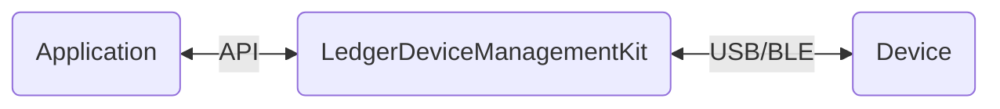

<p align="center">
 
 <h2 align="center">Web Device Management Kit</h2>
  <p align="center">
  <!-- Update with each individual package version -->
    <!-- Enable and display when CI set up -->
    <a href="https://www.typescriptlang.org/">
      
    </a>
    <a href="https://eslint.org/">
      
    </a>
    <a href="https://prettier.io/">
      
    </a>
    <a href="https://jestjs.io/">
      
    </a>
<br />
    <a href="https://nextjs.org/">
      
    </a>
    <a href="https://vercel.com/">
      
    </a>
    <a href="https://www.npmjs.com/">
      
    </a>
<br />
    <a href="https://github.com/LedgerHQ/device-sdk-ts/actions/workflows/pull_request.yml">
      
    </a>
  </p>

  <p align="center">
    <a href="https://developers.ledger.com/docs/live-app/start-here/">Ledger Developer Portal</a>
    ·
    <a href="https://github.com/LedgerHQ/device-sdk-ts/issues/new/choose">Report Bug</a>
    ·
    <a href="https://github.com/LedgerHQ/device-sdk-ts/issues/new/choose">Request Feature</a>
  </p>
  <!-- Also add monorepo docuzaurus doc when available -->
</p>

# Introduction

The Device Management Kit (DMK) is a TypeScript library that provides easy communication with Ledger devices:

- Device discovery, identification, and connection
- Device management operations (app installation, device info retrieval) with comprehensive status tracking and error handling
- Ledger OS interaction
- App interaction for cryptographic operations
  - Address derivation, message and transaction signing
- App installation and management
- 🔜 OS updates

⚠️
<mark>
** The Device Management Kit is in alpha stage and is subject to significant changes!!!**
</mark>
⚠️

## How it works

The Device Management Kit features an interface for applications to handle any Ledger device (a.k. hardware wallets). It converts intention into



The Device Management Kit is available in 3 different environments (web, Android & iOS).

This repository contains the **web implementation** of the Device Management Kit, built with TypeScript.

## Structure

### Repository

The Device Management Kit is structured as a monorepository that centralizes all TypeScript code related to the Device Management Kit in one place.

This project uses [turbo monorepo](https://turbo.build/repo/docs) to build and release different packages on NPM registry and a sample demo application on Vercel.

### Packages

A brief overview of this project's packages:

### Core Packages

| Name                            | Path                           | Description                                                          |
| ------------------------------- | ------------------------------ | -------------------------------------------------------------------- |
| @ledgerhq/device-management-kit | packages/device-management-kit | Core package containing the main Device Management Kit functionality |

### Transport Packages

| Name                                            | Path                        | Description                                   |
| ----------------------------------------------- | --------------------------- | --------------------------------------------- |
| @ledgerhq/device-transport-kit-web-hid          | packages/transport/web-hid  | Web HID transport implementation              |
| @ledgerhq/device-transport-kit-web-ble          | packages/transport/web-ble  | Web BLE transport implementation              |
| @ledgerhq/device-transport-kit-react-native-ble | packages/transport/rn-ble   | React Native BLE transport implementation     |
| @ledgerhq/device-transport-kit-react-native-hid | packages/transport/rn-hid   | React Native HID transport implementation     |
| @ledgerhq/device-transport-kit-speculos         | packages/transport/speculos | Speculos transport implementation for testing |

### Signer Packages

| Name                                 | Path                          | Description                                  |
| ------------------------------------ | ----------------------------- | -------------------------------------------- |
| @ledgerhq/device-signer-kit-bitcoin  | packages/signer/signer-btc    | Bitcoin coin application dedicated handlers  |
| @ledgerhq/device-signer-kit-ethereum | packages/signer/signer-eth    | Ethereum coin application dedicated handlers |
| @ledgerhq/device-signer-kit-solana   | packages/signer/signer-solana | Solana coin application dedicated handlers   |

### Trusted Apps

| Name                                                     | Path                                          | Description                            |
| -------------------------------------------------------- | --------------------------------------------- | -------------------------------------- |
| @ledgerhq/device-trusted-app-kit-ledger-keyring-protocol | packages/trusted-apps/ledger-keyring-protocol | Ledger Keyring Protocol implementation |

### Development & Testing

| Name                                                  | Path                           | Description                                                                     |
| ----------------------------------------------------- | ------------------------------ | ------------------------------------------------------------------------------- |
| @ledgerhq/device-management-kit-sample                | apps/sample                    | React Next web app used to test & demonstrate the Device Management Kit         |
| @ledgerhq/device-management-kit-flipper-plugin-client | packages/flipper-plugin-client | [Flipper](https://github.com/facebook/flipper) logger for Device Management Kit |
| @ledgerhq/device-mockserver-client                    | packages/mockserver-client     | Client to interact with the mock-server                                         |

### Internal Configuration

| Name                         | Path                       | Description                     |
| ---------------------------- | -------------------------- | ------------------------------- |
| @ledgerhq/eslint-config-dsdk | packages/config/eslint     | ESLint shared configuration     |
| @ledgerhq/vitest-config-dmk  | packages/config/vitest     | Vitest shared configuration     |
| @ledgerhq/tsconfig-dsdk      | packages/config/typescript | TypeScript shared configuration |

# Getting started

> 💡 **The following steps describe only a minimal setup. You will need to perform additional installation steps depending on the package you want to work on, please refer to its nested README file.**

## Environment Setup

### Proto

**proto** is used as the toolchain manager to install the right version of every tool.

**⚠️ Important**: Please follow the instructions on the [**proto**](https://moonrepo.dev/docs/proto/install) documentation to install it.

### Dependencies management

**pnpm** is used as the package manager to install all the dependencies.
It is normally provided by **Proto** (see below).

## Installation

1- Clone the repository

```bash
git clone git@github.com:LedgerHQ/device-sdk-ts.git
cd device-sdk-ts
```

**Important: All the commands should be run at the root of the monorepo.**

2- Configure using proto

```bash
proto use
```

3- Install dependencies

```bash
pnpm i
```

4- Check the shell configuration file

In you shell configuration file (e.g. .bashrc or .zshrc ) verify the path for `proto` is correctly set.
Update it if needed according to the description below.

```bash
# proto
export PROTO_HOME="$HOME/.proto"
export PATH="$PROTO_HOME/shims:$PROTO_HOME/bin:$PATH"
```

## Unit Test

**Vitest** is used for unit testing.

Each package is tested using the following command (at the root of the monorepo).

```bash
pnpm <package> test
```

## Build

Each package is built using the following command (at the root of the monorepo).

### Device Management Kit

Device Management Kit main module.

```bash
pnpm dmk build
```

### Signers

Transaction and message signing module.
Each signer is its own package. Here is an exemple with the Ethereum signer:

```bash
pnpm signer-eth build
```

### Trusted Apps

Security dedicated application interface module.
Example with the Ledger Keyring Protocol trusted app:

```bash
pnpm app-keyring build
```

### Sample application

Sample application module.

```bash
pnpm sample build
```

#### Documentation

```bash
pnpm doc build
```

# Processes & usage

## Continuous integration

This project uses Github CI. Please have a look to the following link for more details: [GitHub](https://docs.github.com/en/actions/automating-builds-and-tests/about-continuous-integration)

## Scripting

To avoid task repetition, you can add scripts to the corresponding package's script folder, or to a root script folder if they concern multiple packages.
A script is a `.mjs` file interpreted by [zx](https://github.com/google/zx).

## Templates

We use `hygen` to quickly scaffold code and accelerate our development process.
Each project can have its own `_templates` folder, making **generators** scoped to their respective projects.
The `_templates` folder contains the basic generators to create new ones.

[Hygen documentation](https://www.hygen.io/docs/quick-start/)

### Available templates

| workspace | script          | description                           |
| --------- | --------------- | ------------------------------------- |
| 📦 dmk    | `module:create` | scaffolds a new _src/internal_ module |

### Process for adding a new generator

The easiest way would be to use `hygen` from the root folder as so:

**Options**:

- `new`: creates a generator that takes no input during creation (but can still access metadata)
- `with-prompt`: creates a generator that can take some input during creation (with access to metadata)

**Important: All the commands should be run at the root of the monorepo.**

```
pnpm hygen generator with-prompt|new name
```

This command will create a new generator folder in the root `_templates` with the given `name`.
It's there so that we can modify this new generator.
When done, move the new generator to it's correct project `_templates` folder (again, so we can keep scope).
Finally, we should add a script in the correct `package.json` as a shortcut to trigger the new generator.
eg:

```
pnpm dmk module:create
```

Under the hood, the script looks like this:

```
pnpm hygen <name> with-prompt
```

- `name` is the name given during the creation of the generator.
- `with-prompt` to call the prompted version of the generator (there can be multiple targets, like `new`)

## Play with the sample app ?

To build the required dependencies and start a dev server for the sample app, please execute the following command at the root of the repository.

```bash
pnpm dev
```

# Documentation

Each project folder has a `README.md` file which contains basic documentation.
It includes background information about the project and how to setup, run and build it.

## Reference API

Please refer to the core package [**readme**](https://github.com/LedgerHQ/device-sdk-ts/blob/develop/packages/device-management-kit/README.md).

# Contributing

Please check the general guidelines for contributing to Ledger Live projects: [`CONTRIBUTING.md`](https://github.com/LedgerHQ/device-sdk-ts/blob/develop/CONTRIBUTING.md).

Each individual project may include its own specific guidelines, located within its respective folder.

# License

Please check each project's [`LICENSE`](https://github.com/LedgerHQ/device-sdk-ts/blob/develop/LICENSE.md) file, most of them are under the `Apache-2.0` license.
