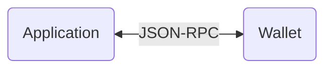

 
 <h2 align="center">Web Device SDK</h2>
  

  <!-- Update with each individual package version -->
    <!-- Enable and display when CI set up -->
    <!--  -->
    
    
    
    
 
    
    
    
  

  

    <a href="https://developers.ledger.com/docs/live-app/start-here/">Ledger Developer Portal</a>
    ·
    <a href="https://github.com/LedgerHQ/device-sdk-ts/issues/new/choose">Report Bug</a>
    ·
    <a href="https://github.com/LedgerHQ/device-sdk-ts/issues/new/choose">Request Feature</a>
  

  <!-- Also add monorepo docuzaurus doc when available -->

# About

This monorepo hosts the Device SDK for Web. 
Written in Typescript.

# How does it works

The Device SDK defines an interface for applications to interact with Ledger wallets.

<!-- TODO: link to reference implementations of client and server once available -->

# Modules description

This project uses [turbo monorepo](https://turbo.build/repo/docs) to build and release different packages on NPM registry and a sample demo app on Vercel.  

A brief description of this project packages:

* `@ledgerhq/device-sdk-sample` in `apps/sample`: React Next web app used to test & demonstrate the Web Device SDK
* `@ledgerhq/eslint-config-dsdk` in `packages/config/eslint`: internal package which contains eslint shared config. Used by `extends: ["@ledgerhq/dsdk"]` in `.eslintrc`.
* `@ledgerhq/jest-config-dsdk` in `packages/config/jest`: internal package which contains jest shared config. Used by `preset: "@ledgerhq/jest-config-dsdk"` in `jest.config.ts`
* `@ledgerhq/tsconfig-dsdk` in `packages/config/typescript`: internal package which contains typescript shared config. Used by `"extends": "@ledgerhq/tsconfig-dsdk/sdk"` in `tsconfig.json`
* `@ledgerhq/device-sdk-core` in `packages/core`: external package that contains the core of the Web SDK
* `@ledgerhq/device-sdk-signer` in `packages/signer`: external package
* `@ledgerhq/device-sdk-trusted-apps` in `packages/trusted-apps`: external package
* `@ledgerhq/device-sdk-ui` in `packages/ui`: external package

# CI

This project uses Github CI. 

# Scripting

In order to avoid task repetition, we can add some scripts the corresponding package's script folder, on in a root script folder if it concerns multiple packages.
A script is a `.mjs` file interpreted by [zx](https://github.com/google/zx).

