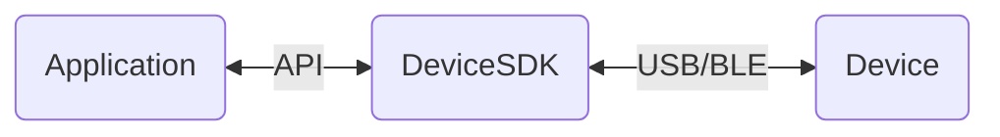

<p align="center">
 
 <h2 align="center">Web Device Management Kit</h2>
  <p align="center">
  <!-- Update with each individual package version -->
    <!-- Enable and display when CI set up -->
    <!-- <a href="https://github.com/LedgerHQ/platform-sdk/actions">
      
    </a> -->
    <a href="https://www.typescriptlang.org/">
      
    </a>
    <a href="https://eslint.org/">
      
    </a>
    <a href="https://prettier.io/">
      
    </a>
    <a href="https://jestjs.io/">
      
    </a>
<br />
    <a href="https://nextjs.org/">
      
    </a>
    <a href="https://vercel.com/">
      
    </a>
    <a href="https://www.npmjs.com/">
      
    </a>
  </p>

  <p align="center">
    <a href="https://developers.ledger.com/docs/live-app/start-here/">Ledger Developer Portal</a>
    ·
    <a href="https://github.com/LedgerHQ/device-sdk-ts/issues/new/choose">Report Bug</a>
    ·
    <a href="https://github.com/LedgerHQ/device-sdk-ts/issues/new/choose">Request Feature</a>
  </p>
  <!-- Also add monorepo docuzaurus doc when available -->
</p>

# Introduction

The purpose of the Ledger Device Management Kit(LDMK in short) is to provide a library in TypeScript to easily handle Ledger devices:

- Device enumeration, identification and connection management
- Device actions, with full status and error report
- In the future: Firmware and Applications installation/update.

⚠️
<mark>
**The current version of this Device Management Kit is in alpha stage and is subject to significant changes!!!**
</mark>
⚠️

## How does it works

The Device Management Kit features an interface for applications to handle any Ledge device (a.k. hardware wallets). It convert intention into



The Device Management Kit is available in 3 different environments (web, Android & iOS).

This repository is dedicated to **web environment** and is written in TypeScript.

## Structure

### Repository

The Device Management Kit is structured as a monorepository whose prupose is to centralise all the TypeScript code related to the SDK in one place.

This project uses [turbo monorepo](https://turbo.build/repo/docs) to build and release different packages on NPM registry and a sample demo application on Vercel.

### Modules

A brief description of this project packages:

| Name                              | Path                       | Description                                                                                                                              |
| --------------------------------- | -------------------------- | ---------------------------------------------------------------------------------------------------------------------------------------- |
| @ledgerhq/device-sdk-sample       | apps/sample                | React Next web app used to test & demonstrate the Web Device Management Kit                                                              |
| @ledgerhq/eslint-config-dsdk      | packages/config/eslint     | internal package which contains eslint shared config. Used by `extends: ["@ledgerhq/dsdk"]` in `.eslintrc`.                              |
| @ledgerhq/jest-config-dsdk        | packages/config/jest       | internal package which contains jest shared config. Used by `preset: "@ledgerhq/jest-config-dsdk"` in `jest.config.ts`                   |
| @ledgerhq/tsconfig-dsdk           | packages/config/typescript | internal package which contains typescript shared config. Used by `"extends": "@ledgerhq/tsconfig-dsdk/tsconfig.sdk"` in `tsconfig.json` |
| @ledgerhq/device-management-kit   | packages/core              | external package that contains the core of the Web SDK                                                                                   |
| @ledgerhq/device-sdk-signer       | packages/signer            | external package that contains device coin application dedicated handlers                                                                |
| @ledgerhq/device-sdk-trusted-apps | packages/trusted-apps      | external package that contains device trusted application dedicated handlers                                                             |
| @ledgerhq/device-sdk-ui           | packages/ui                | external package                                                                                                                         |

# Getting started

> 💡 **The following steps described only a minimal setup. You will need to perform additional installation steps depending on the package you want to work on, please refer to its nested readme file.**

## Prerequisites

### Shell

Install your favorite shell or use your computer built in one (e.g. bash, zsh or fish )

### Git

Please install git.

## Environment Setup

### Proto

**proto** is used as the toolchain manager to install the right version of every tools.

**⚠️ Important**: Please follow the instructions on the [**proto**](https://moonrepo.dev/docs/proto/install) website to install it.

### Dependencies management

**pnpm** is used as the package manager to install all the dependencies.
It is normally provided by **Proto** (see below).

## Installation

1- Clone the repository

```bash
git clone git@github.com:LedgerHQ/device-sdk-ts.git
cd device-sdk-ts
```

**Important: All the commands should be run at the root of the monorepo.**

2- Configure using proto

```bash
proto use
```

3- Install dependencies

```bash
pnpm i
```

Alternatively, if you want to bypass the postinstall scripts which can be long to run.

```bash
pnpm i --ignore-scripts
```

4- Check the shell configuration file

In you shell configuration file (e.g. .bashrc or .zshrc ) verify the path for `proto` is correctly set.
Update it if needed according to the description below.

```bash
# proto
export PROTO_HOME="$HOME/.proto"
export PATH="$PROTO_HOME/shims:$PROTO_HOME/bin:$PATH"
```

## Unit Test

**Jest** is used for unit testing purpose.

Each package is tested using the following command (at the root of the monorepo).

```bash
pnpm <package> test
```

### VSCode user

For VSCode user, this monorepo is a multi-root workspace.
Please configure JEST extention accordingly.

## Build

Each package is built using the following command (at the root of the monorepo).

### Core

Device Management Kit main module.

```bash
pnpm core build
```

### Signer

Transaction and message signer module.

```bash
pnpm signer build
```

### Trusted Apps

Security dedicated application interface module.

```bash
pnpm trusted-apps build
```

### UI

Reference UI module

```bash
pnpm ui build
```

### Sample application

Sample application module.

```bash
pnpm sample build
```

# Processes & usage

## Continuous integration

This project uses Github CI. Please have a look to the following link for more details: [GitHub](https://docs.github.com/en/actions/automating-builds-and-tests/about-continuous-integration)

## Scripting

In order to avoid task repetition, we can add some scripts the corresponding package's script folder, on in a root script folder if it concerns multiple packages.
A script is a `.mjs` file interpreted by [zx](https://github.com/google/zx).

## Templates

To kickly scaffold part of our code, we use `hygen` to help us kickstart our development process faster.
Each project can have it's own `_templates` folder, so **generators** are scoped.
The `_templates` folder contains the basic generators to create new ones.

[Hygen documentation](https://www.hygen.io/docs/quick-start/)

### Process for adding a new generator

The easiest way would be to use `hygen` from the root folder as so:

**Options**:

- `new`: creates a generator that take no input during creation (but can still access metadata)
- `with-prompt`: creates a generator that can take some input during creation (with access to metadata)

**Important: All the commands should be run at the root of the monorepo.**

```
pnpm hygen generator with-prompt|new name
```

This command will create a new generator folder in the root `_templates` with the given `name`.
It's there so that we can modify this new generator.
When done, move the new generator to it's correct project `_templates` folder (again, so we can keep scope).
Finally, we should add a script in the correct `package.json` as a shortcut to trigger the new generator.
eg:

```
pnpm core module:create
```

Under the hood, the script looks like this:

```
pnpm hygen <name> with-prompt
```

- `name` is the name given during the creation of the generator.
- `with-prompt` to call the prompted version of the generator (there can be multiple targets, like `new`)

### Available templates

| workspace | script          | description                           |
| --------- | --------------- | ------------------------------------- |
| 📦 core   | `module:create` | scaffolds a new _src/internal_ module |

## Play with the sample app ?

To build the required dependencies and start a dev server for the sample app, please execute the following command at the root of the repository.

```bash
pnpm dev
```

# Documentation

Each project folder has a `README.md` file which contains basic documentation.
It includes background information about the project and how to setup, run and build it.

## Reference API

Please refer to the core package [**readme**](https://github.com/LedgerHQ/device-sdk-ts/blob/develop/packages/core/README.md).

# Contributing

Please check the general guidelines for contributing to Ledger Live projects: [`CONTRIBUTING.md`](https://github.com/LedgerHQ/device-sdk-ts/blob/develop/CONTRIBUTING.md).

Each individual project may include its own specific guidelines, located within its respective folder.

# License

Please check each project [`LICENSE`](https://github.com/LedgerHQ/device-sdk-ts/blob/develop/LICENSE.md) file, most of them are under the `MIT` license.
