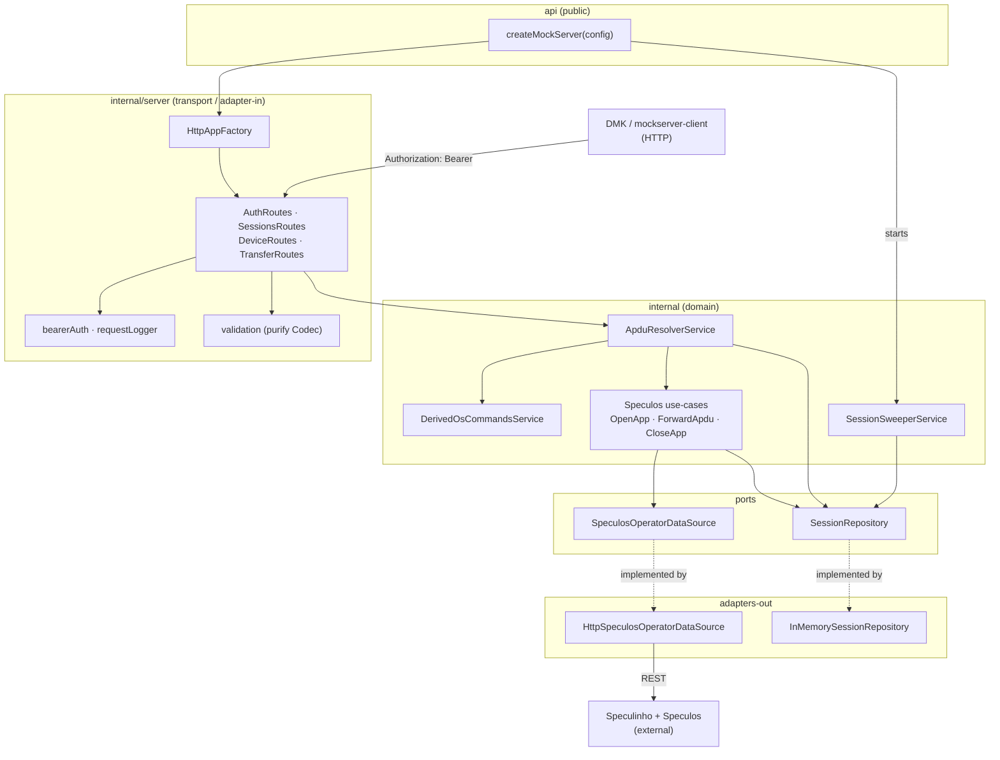
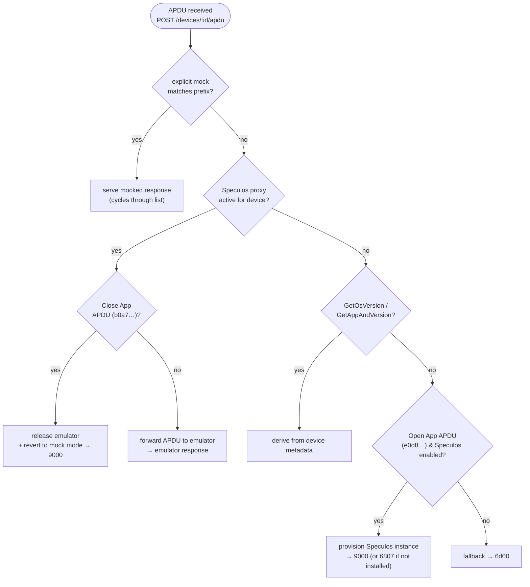
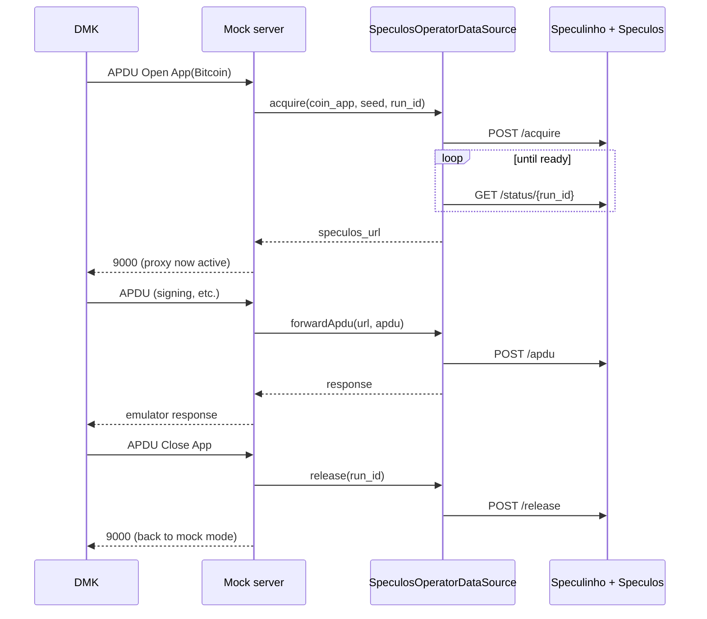

# Device Mock Server

An HTTP server that emulates Ledger devices for the [Device Management Kit](https://github.com/LedgerHQ/device-sdk-ts) (DMK). It lets you script device behaviour (APDU request/response pairs) per device, derives the standard handshake (`GetOsVersion` / `GetAppAndVersion`) from device metadata, and — optionally — proxies real APDUs to a live [Speculos](https://github.com/LedgerHQ/speculos) emulator via [Speculinho](https://ledgerhq.atlassian.net/wiki/spaces/PE/pages/7100399635) when an app is opened.

It is the server-side counterpart of [`@ledgerhq/device-mockserver-client`](../../packages/mockserver-client) and the `MockTransport` used by DMK in tests and the sample apps.

## 🔹 Index

1. [Overview](#-overview)
2. [Architecture](#-architecture)
   - [Component graph](#component-graph)
   - [Layers](#layers)
3. [APDU resolution](#-apdu-resolution)
4. [Speculos integration](#-speculos-integration)
5. [Getting started](#-getting-started)
6. [Configuration](#-configuration)
7. [HTTP API](#-http-api)
8. [Programmatic usage](#-programmatic-usage)
9. [Testing](#-testing)
10. [OpenAPI](#-openapi)

## 🔹 Overview

The mock server is **session-scoped** and **device-scoped**:

- A client calls `POST /auth` to open a session and receives a **bearer token**.
- Within a session it attaches one or more **mocked devices**, each carrying its own metadata (model, firmware, installed apps) and its own **APDU mocks**.
- When DMK sends an APDU to a device, the server resolves a response following a fixed [precedence](#-apdu-resolution). The OS/app handshake does not need to be mocked — it is derived from the device's metadata.
- Sessions expire on a sliding inactivity TTL (and a hard lifetime cap); a background sweeper disposes expired sessions and releases any Speculos instances they held.

Everything is held **in memory** — there is no database. Restarting the server clears all state.

## 🔹 Architecture

The server follows the monorepo's hexagonal philosophy: a public `api/` surface, a private `internal/` implementation split into feature modules, dependencies wired through an [InversifyJS](https://inversify.io/) container, and `purify-ts` `Either`/`Maybe` for typed error handling. Ports (interfaces) live next to their feature; adapters implement them.

### Component graph



### Layers

| Layer                      | Location                                                      | Responsibility                                                                                                                                                                                                 |
| -------------------------- | ------------------------------------------------------------- | -------------------------------------------------------------------------------------------------------------------------------------------------------------------------------------------------------------- |
| **Public API**             | `src/api`                                                     | `createMockServer(config)` (composition root) + `MockServerConfig`/`MockServerApp` types. The only thing exported from the package.                                                                            |
| **DI**                     | `src/internal/di`                                             | Builds the Inversify container, loading each feature's module factory.                                                                                                                                         |
| **Transport (adapter-in)** | `src/internal/server`                                         | `HttpAppFactory` composes the Express app; the four injectable `*Routes` classes mount the endpoints; `bearerAuth`/`requestLogger` middleware; request DTOs validated with `purify` `Codec`.                   |
| **Domain**                 | `src/internal/apdu`, `derived`, `speculos`, `session`         | `ApduResolverService` orchestrates resolution; `DerivedOsCommandsService` synthesizes the handshake; Speculos use-cases (`OpenApp`/`ForwardApdu`/`CloseApp`); `SessionSweeperService` evicts expired sessions. |
| **Ports**                  | `*/data/*.ts`, `session/data/SessionRepository.ts`            | Interfaces the domain depends on: `SessionRepository`, `SpeculosOperatorDataSource`.                                                                                                                           |
| **Adapters (adapter-out)** | `InMemorySessionRepository`, `HttpSpeculosOperatorDataSource` | Concrete implementations of the ports.                                                                                                                                                                         |

## 🔹 APDU resolution

`ApduResolverService.resolve()` applies a fixed precedence for every incoming APDU:



1. **Explicit per-device mock** — an exact-prefix match always wins, **even while a Speculos proxy is active** (multi-response mocks cycle). This lets you override a single app response mid-session — e.g. mock `GetAppAndVersion` to `5515` to simulate a locked device while the app runs on the emulator.
2. **Active Speculos proxy** — once an app is open, unmatched APDUs are forwarded to the emulator; `Close App` releases it and reverts to mock mode.
3. **Derived handshake** — `GetOsVersion` / `GetAppAndVersion` are synthesized from the device's firmware/app metadata, so they never need mocking (but can be overridden by a mock).
4. **Unmatched Open App** — when Speculos is configured, provisions a real emulator for the requested app (`6807` if the app is not installed on the device).
5. **Fallback** — `6d00`.

## 🔹 Speculos integration

When `config.speculos` is set, opening an app provisions a live emulator through Speculinho and proxies APDUs to it. The raw passthrough (`/devices/:id/speculos/*`) goes through the `SpeculosOperatorDataSource` port — no `fetch` in the routes.



> The `coin_app` sent to Speculinho must be the verbatim BOLOS app name (e.g. `Ethereum`, not `eth`).

## 🔹 Getting started

Install dependencies from the **monorepo root**:

```bash
pnpm install
```

Run the server in watch mode (from this directory or via `pnpm --filter @ledgerhq/device-mock-server`):

```bash
pnpm dev          # tsx watch src/main.ts
# or run once without watching
pnpm serve
```

Build and run the compiled server:

```bash
pnpm build
pnpm start        # node lib/cjs/main.js
```

By default it listens on port `8080`. Verify it is up:

```bash
curl http://127.0.0.1:8080/health
# {"status":"ok","sessions":0}
```

## 🔹 Configuration

The standalone server (`src/main.ts`) reads environment variables:

| Variable                    | Default                             | Description                                                                                                         |
| --------------------------- | ----------------------------------- | ------------------------------------------------------------------------------------------------------------------- |
| `PORT`                      | `8080`                              | HTTP port.                                                                                                          |
| `SPECULINHO_URL`            | `https://speculinho.ledgerlabs.net` | Speculinho operator base URL. Set to empty (`SPECULINHO_URL=`) to run as a **pure mock** with no Speculos proxying. |
| `SPECULOS_SEED`             | built-in default seed               | BIP39 seed used for provisioned emulators.                                                                          |
| `SPECULOS_VERSION`          | _unset_                             | Pin a Speculos version.                                                                                             |
| `SPECULOS_READY_TIMEOUT_MS` | `120000`                            | How long to wait for an emulator to become ready.                                                                   |

Programmatically, `createMockServer(config)` accepts a `MockServerConfig`:

| Option            | Description                                                                                                       |
| ----------------- | ----------------------------------------------------------------------------------------------------------------- |
| `ttlMs`           | Sliding inactivity timeout (refreshed on each authed request).                                                    |
| `maxLifetimeMs`   | Hard cap on session lifetime regardless of activity.                                                              |
| `sweepIntervalMs` | Expired-session sweep interval; `0` disables the sweeper.                                                         |
| `speculos`        | `{ baseUrl, seed, speculosVersion?, readyTimeoutMs?, pollIntervalMs? }`. When omitted, the server is a pure mock. |

## 🔹 HTTP API

All routes except `POST /auth` and `GET /health` require an `Authorization: Bearer <token>` header.

| Method & path                                 | Description                                                           |
| --------------------------------------------- | --------------------------------------------------------------------- |
| `POST /auth`                                  | Create a session, returns `{ token, expires_at }`.                    |
| `GET /health`                                 | Liveness probe (no auth).                                             |
| `GET` / `DELETE /sessions/current`            | Inspect / dispose the current session.                                |
| `GET` / `POST /devices`                       | List / attach devices.                                                |
| `GET` / `PATCH` / `DELETE /devices/:id`       | Read / edit / remove a device.                                        |
| `POST /devices/:id/connect` · `/disconnect`   | Toggle connection state.                                              |
| `POST /devices/:id/apdu`                      | Resolve an APDU (`{ apdu }` → `{ response }`).                        |
| `GET` / `POST` / `DELETE /devices/:id/mocks`  | List / add / clear device mocks.                                      |
| `PATCH` / `DELETE /devices/:id/mocks/:mockId` | Edit / remove a single mock.                                          |
| `GET /devices/:id/speculos`                   | The device's active Speculos instance (`409` if none).                |
| `ALL /devices/:id/speculos/*`                 | Raw passthrough to the device's emulator.                             |
| `GET /export` · `POST /import`                | Export / import a portable session snapshot (devices + nested mocks). |

The full contract is generated as [`openapi.yaml`](./openapi.yaml).

## 🔹 Programmatic usage

The package exports the composition root so it can be embedded (e.g. in tests) without binding a port:

```ts
import { createMockServer } from "@ledgerhq/device-mock-server";

const { app, close } = createMockServer({ sweepIntervalMs: 0 });
const server = app.listen(0); // ephemeral port

// ... drive it over HTTP, then:
server.close();
close(); // stop the background sweeper
```

## 🔹 Testing

```bash
pnpm test            # vitest run
pnpm test:watch
pnpm test:coverage
```

The suite mixes focused unit tests (resolver, repository, codecs, Speculos use-cases, sweeper, auth middleware) with HTTP-contract integration tests that drive the fully-assembled server over a loopback socket — including a Speculos lifecycle test with `fetch` mocked in place of Speculinho. The live Speculos path is covered by the Playwright e2e suite.

## 🔹 OpenAPI

The spec is produced from the `@openapi` JSDoc blocks next to the route handlers:

```bash
pnpm generate:openapi   # writes openapi.yaml
```
