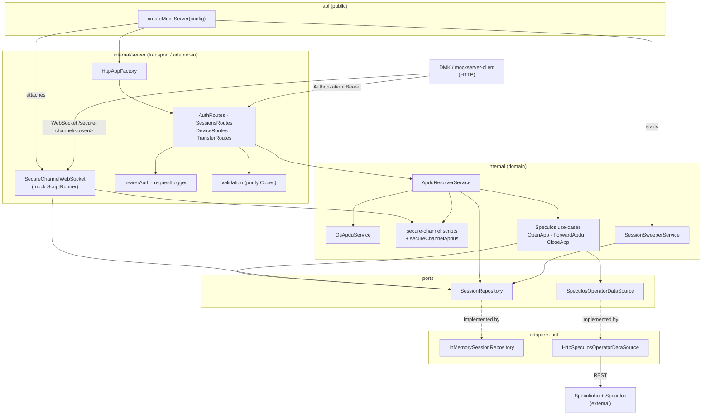
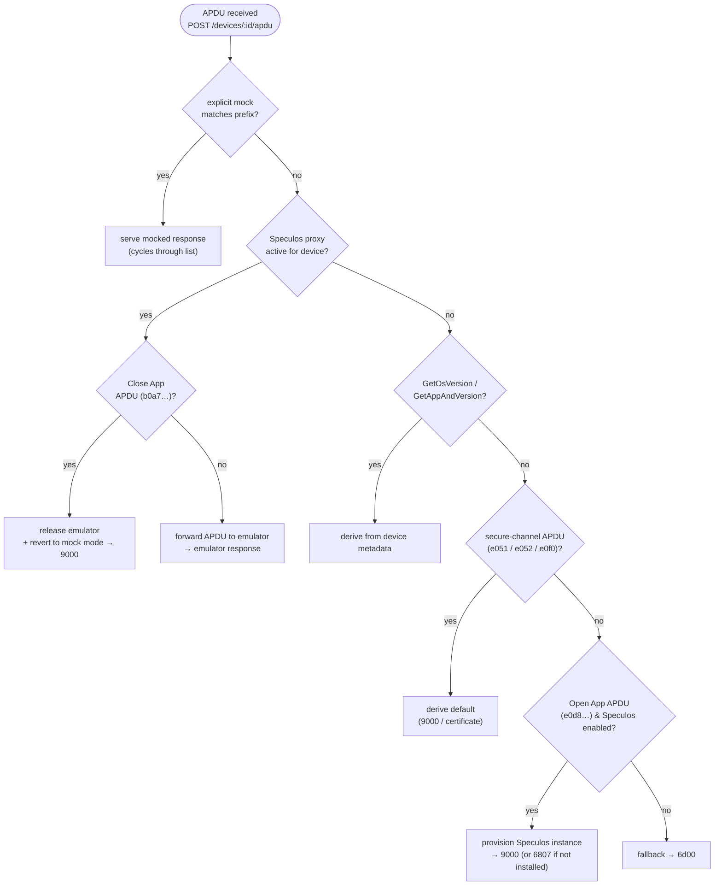
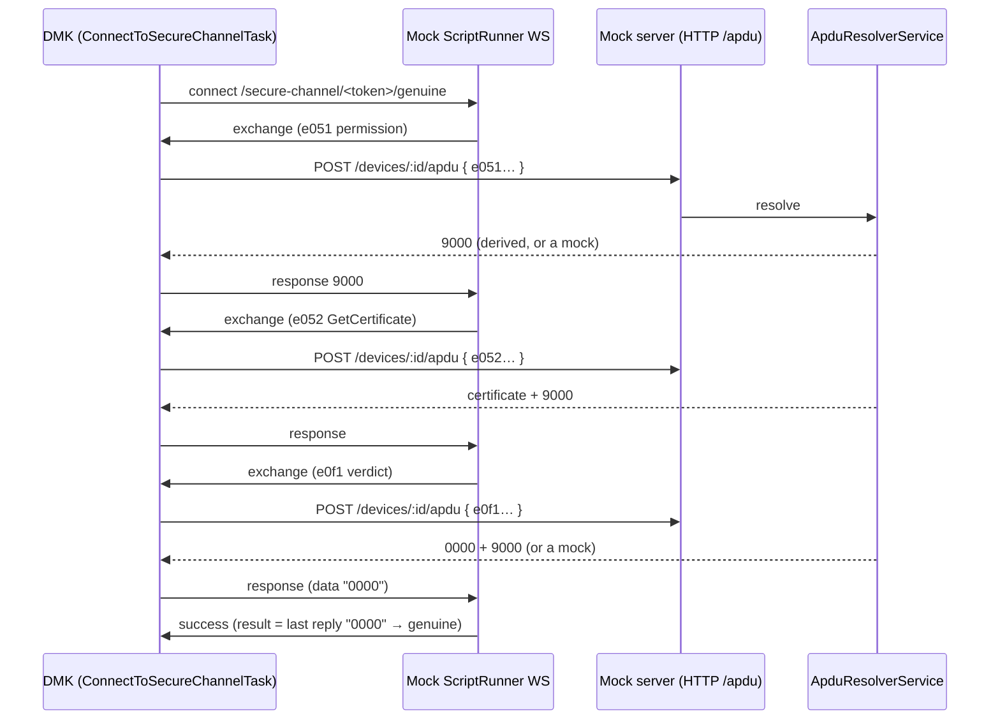
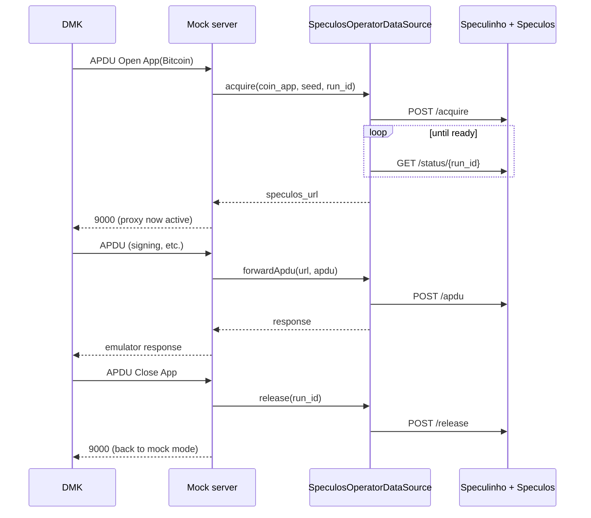

# Device Mock Server

An HTTP server that emulates Ledger devices for the [Device Management Kit](https://github.com/LedgerHQ/device-sdk-ts) (DMK). It lets you script device behaviour (APDU request/response pairs) per device, derives the standard handshake (`GetOsVersion` / `GetAppAndVersion`) from device metadata, exposes a mock [ScriptRunner](#-secure-channel-websocket) WebSocket so secure-channel device actions (genuine check, app management) can run fully offline, and — optionally — proxies real APDUs to a live [Speculos](https://github.com/LedgerHQ/speculos) emulator via [Speculinho](https://ledgerhq.atlassian.net/wiki/spaces/PE/pages/7100399635) when an app is opened.

It is the server-side counterpart of [`@ledgerhq/device-mockserver-client`](../../packages/mockserver-client) and the `MockTransport` used by DMK in tests and the sample apps.

## 🔹 Index

1. [Overview](#-overview)
2. [Architecture](#-architecture)
   - [Component graph](#component-graph)
   - [Layers](#layers)
3. [APDU resolution](#-apdu-resolution)
4. [Secure channel WebSocket](#-secure-channel-websocket)
5. [Speculos integration](#-speculos-integration)
6. [Getting started](#-getting-started)
7. [Docker](#-docker)
8. [Configuration](#-configuration)
9. [HTTP API](#-http-api)
10. [Programmatic usage](#-programmatic-usage)
11. [Testing](#-testing)
12. [OpenAPI](#-openapi)

## 🔹 Overview

The mock server is **session-scoped** and **device-scoped**:

- A client calls `POST /auth` to open a session and receives a **bearer token**.
- Within a session it attaches one or more **mocked devices**, each carrying its own metadata (model, firmware, installed apps) and its own **APDU mocks**.
- When DMK sends an APDU to a device, the server resolves a response following a fixed [precedence](#-apdu-resolution). The OS/app handshake does not need to be mocked — it is derived from the device's metadata.
- Secure-channel device actions (genuine check, list/install/uninstall apps) connect to a mock [ScriptRunner WebSocket](#-secure-channel-websocket) that relays scripted APDUs back through the same device mock table, so they run with no HSM and no network.
- Sessions expire on a sliding inactivity TTL (and a hard lifetime cap); a background sweeper disposes expired sessions and releases any Speculos instances they held.

Everything is held **in memory** — there is no database. Restarting the server clears all state.

## 🔹 Architecture

The server follows the monorepo's hexagonal philosophy: a public `api/` surface, a private `internal/` implementation split into feature modules, dependencies wired through an [InversifyJS](https://inversify.io/) container, and `purify-ts` `Either`/`Maybe` for typed error handling. Ports (interfaces) live next to their feature; adapters implement them.

### Component graph



### Layers

| Layer                      | Location                                                           | Responsibility                                                                                                                                                                                                                                                                                           |
| -------------------------- | ------------------------------------------------------------------ | -------------------------------------------------------------------------------------------------------------------------------------------------------------------------------------------------------------------------------------------------------------------------------------------------------- |
| **Public API**             | `src/api`                                                          | `createMockServer(config)` (composition root) + `MockServerConfig`/`MockServerApp` types. The only thing exported from the package.                                                                                                                                                                      |
| **DI**                     | `src/internal/di`                                                  | Builds the Inversify container, loading each feature's module factory.                                                                                                                                                                                                                                   |
| **Transport (adapter-in)** | `src/internal/server`, `src/internal/secure-channel`               | `HttpAppFactory` composes the Express app; the four injectable `*Routes` classes mount the endpoints; `bearerAuth`/`requestLogger` middleware; request DTOs validated with `purify` `Codec`. `SecureChannelWebSocket` attaches the mock ScriptRunner WebSocket to the same HTTP server.                  |
| **Domain**                 | `src/internal/apdu`, `os`, `secure-channel`, `speculos`, `session` | `ApduResolverService` orchestrates resolution; `OsApduService` synthesizes the handshake; the secure-channel `scripts`/`secureChannelApdus` define the relayed APDU choreography and defaults; Speculos use-cases (`OpenApp`/`ForwardApdu`/`CloseApp`); `SessionSweeperService` evicts expired sessions. |
| **Ports**                  | `*/data/*.ts`, `session/data/SessionRepository.ts`                 | Interfaces the domain depends on: `SessionRepository`, `SpeculosOperatorDataSource`.                                                                                                                                                                                                                     |
| **Adapters (adapter-out)** | `InMemorySessionRepository`, `HttpSpeculosOperatorDataSource`      | Concrete implementations of the ports.                                                                                                                                                                                                                                                                   |

## 🔹 APDU resolution

`ApduResolverService.resolve()` applies a fixed precedence for every incoming APDU:



1. **Explicit per-device mock** — an exact-prefix match always wins, **even while a Speculos proxy is active** (multi-response mocks cycle). This lets you override a single app response mid-session — e.g. mock `GetAppAndVersion` to `5515` to simulate a locked device while the app runs on the emulator.
2. **Active Speculos proxy** — once an app is open, unmatched APDUs are forwarded to the emulator; `Close App` releases it and reverts to mock mode.
3. **Derived handshake & secure-channel APDUs** — `GetOsVersion` / `GetAppAndVersion` are synthesized from the device's firmware/app metadata, and the [secure-channel](#-secure-channel-websocket) relayed APDUs (`e051` permission, `e052` GetCertificate, `e0f0` install block) derive to sensible defaults (`9000` / a parseable certificate). All of these never need mocking but can be overridden by a mock — which is how secure-channel error paths are injected.
4. **Unmatched Open App** — when Speculos is configured, provisions a real emulator for the requested app (`6807` if the app is not installed on the device).
5. **Fallback** — `6d00`.

## 🔹 Secure channel WebSocket

Several DMK device actions — genuine check, list/install/uninstall apps, and anything composing
`GetDeviceMetadata({ useSecureChannel: true })` — do not talk to the device directly. They open a
**WebSocket to Ledger's ScriptRunner backend**, which (driven by the HSM) streams APDUs for DMK to
relay to the device and ships the responses back. DMK itself does no crypto; it is a pure relay
(`ConnectToSecureChannelTask`).

The mock server ships a **mock ScriptRunner** so these flows run fully offline. It
attaches a WebSocket server to the same HTTP server
([`SecureChannelWebSocket.ts`](src/internal/secure-channel/ws/SecureChannelWebSocket.ts)) and speaks the
DMK secure-channel envelope (`exchange` / `bulk` / `success` / `error`).

Because the secure-channel WebSocket carries **no bearer header**, the session token is embedded in
the path: `ws://<host>/secure-channel/<token>/<endpoint>`, where `<endpoint>` is one of `genuine`,
`apps/list`, `install`, `mcu`. The handler resolves the session, picks the connected device (or the
first one), and runs the scripted choreography for that endpoint.



The WebSocket is a thin relay: it never computes a verdict. A terminal `success` simply forwards the
**last relayed APDU's reply** as its `result` (so the genuine verdict is just the resolved `e0f1`
response), or sends an explicit structured `data` payload for `listApps`.

### Default scripts

Each endpoint runs a minimal **handshake** (permission `e051`, then GetCertificate `e052`) followed
by a terminal message ([`scripts.ts`](src/internal/secure-channel/service/scripts.ts)):

| Endpoint   | Path        | After handshake                                                                          |
| ---------- | ----------- | ---------------------------------------------------------------------------------------- |
| `genuine`  | `genuine`   | relay the `e0f1` verdict APDU, then `success` forwarding its reply (`"0000"` → genuine). |
| `listApps` | `apps/list` | `success` with the installed apps derived from metadata.                                 |
| `install`  | `install`   | `bulk` stream of synthetic install APDUs (`e0f0…`).                                      |
| `mcu`      | `mcu`       | bare `success`.                                                                          |

The relayed APDUs and their default responses live in a single source of truth,
[`secureChannelApdus.ts`](src/internal/secure-channel/service/secureChannelApdus.ts) (consumed by both `scripts.ts` and
the resolver). By default they all derive to success, so a device passes without any seeded mocks.

### Injecting error paths

Since the relayed APDUs resolve through the normal [APDU precedence](#-apdu-resolution), an **explicit
device mock overrides the default** — that is how you exercise failure flows. Mock the relevant
prefix to a device error status:

| Scenario                        | Mock                                      |
| ------------------------------- | ----------------------------------------- |
| User refuses on device          | `e051` → `5501` / `6985`                  |
| Device locked                   | `e051` → `5515` / `6982`                  |
| GetCertificate failure          | `e052` → `6d00`                           |
| Out of memory (install)         | `e0f0` → `6a84`                           |
| App already installed (install) | `e0f0` → `6a80`                           |
| Fail on the Nth install block   | `e0f0` → `responses: ["9000", …, "6a84"]` |

DMK maps the non-`9000` status to the corresponding error and ends the operation; the mock
ScriptRunner stops the script when the client reports the error.

A mock can also return an ordered **sequence** of responses for one prefix (`responses` advances one
entry per matching APDU, then loops). That is handy for the install `bulk` stream: seed
`e0f0 → ["9000", "9000", "9000", "9000", "6a84"]` to let the first four blocks succeed and fail the
5th midway through the stream.

## 🔹 Speculos integration

When `config.speculos` is set, opening an app provisions a live emulator through Speculinho and proxies APDUs to it. The raw passthrough (`/devices/:id/speculos/*`) goes through the `SpeculosOperatorDataSource` port — no `fetch` in the routes.



> The `coin_app` sent to Speculinho must be the verbatim BOLOS app name (e.g. `Ethereum`, not `eth`).

## 🔹 Getting started

Install dependencies from the **monorepo root**:

```bash
pnpm install
```

Run the server in watch mode (from this directory or via `pnpm --filter @ledgerhq/device-mock-server`):

```bash
pnpm dev          # tsx watch src/main.ts
# or run once without watching
pnpm serve
```

Build and run the compiled server:

```bash
pnpm build
pnpm start        # node lib/cjs/main.js
```

By default it listens on port `9752`. Verify it is up:

```bash
curl http://127.0.0.1:9752/health
# {"status":"ok","sessions":0}
```

## 🔹 Docker

A `Dockerfile` and `docker-compose.yml` are provided for running the server as a container. The **build context must be the monorepo root** because the image is built from the full workspace.

### Build and run with Docker Compose (recommended)

```bash
# From apps/device-mock-server/
docker compose up --build
```

To run as a **pure mock** (no Speculinho, fully offline):

```bash
SPECULINHO_URL= docker compose up --build
```

Copy `.env.example` to `.env` and edit it to persist your configuration:

```bash
cp .env.example .env
# edit .env, then:
docker compose up --build
```

### Standalone `docker build`

```bash
# From the monorepo root:
docker build -f apps/device-mock-server/Dockerfile -t device-mock-server .
docker run --rm -p 9752:9752 -e SPECULINHO_URL= device-mock-server
```

### Health check

```bash
curl http://127.0.0.1:9752/health
# {"status":"ok","sessions":0}
```

The container exposes port `9752` and includes a built-in health check that hits `/health`.

## 🔹 Configuration

The standalone server (`src/main.ts`) reads environment variables:

| Variable                    | Default                             | Description                                                                                                         |
| --------------------------- | ----------------------------------- | ------------------------------------------------------------------------------------------------------------------- |
| `PORT`                      | `9752`                              | HTTP port.                                                                                                          |
| `SPECULINHO_URL`            | `https://speculinho.ledgerlabs.net` | Speculinho operator base URL. Set to empty (`SPECULINHO_URL=`) to run as a **pure mock** with no Speculos proxying. |
| `SPECULOS_VERSION`          | _unset_                             | Pin a Speculos version.                                                                                             |
| `SPECULOS_READY_TIMEOUT_MS` | `120000`                            | How long to wait for an emulator to become ready.                                                                   |
| `MOCK_SERVER_LOG_LEVEL`     | `info`                              | Console log verbosity. One of `silent`, `error`, `warn`, `info`, `debug`.                                           |

Programmatically, `createMockServer(config)` accepts a `MockServerConfig`:

| Option            | Description                                                                                                 |
| ----------------- | ----------------------------------------------------------------------------------------------------------- |
| `ttlMs`           | Sliding inactivity timeout (refreshed on each authed request).                                              |
| `maxLifetimeMs`   | Hard cap on session lifetime regardless of activity.                                                        |
| `sweepIntervalMs` | Expired-session sweep interval; `0` disables the sweeper.                                                   |
| `speculos`        | `{ baseUrl, speculosVersion?, readyTimeoutMs?, pollIntervalMs? }`. When omitted, the server is a pure mock. |

## 🔹 HTTP API

All routes except `POST /auth` and `GET /health` require an `Authorization: Bearer <token>` header.

| Method & path                                 | Description                                                                                                                                                    |
| --------------------------------------------- | -------------------------------------------------------------------------------------------------------------------------------------------------------------- |
| `POST /auth`                                  | Create a session, returns `{ token, expires_at }`.                                                                                                             |
| `GET /health`                                 | Liveness probe (no auth).                                                                                                                                      |
| `GET` / `DELETE /sessions/current`            | Inspect / dispose the current session.                                                                                                                         |
| `PUT /sessions/current/seed`                  | Set the BIP39 mnemonic used for Speculos emulators in this session (`{ seed }`). ⚠️ **Not secure** — stored and transmitted in plaintext. Test mnemonics only. |
| `GET` / `POST /devices`                       | List / attach devices.                                                                                                                                         |
| `GET` / `PATCH` / `DELETE /devices/:id`       | Read / edit / remove a device.                                                                                                                                 |
| `POST /devices/:id/connect` · `/disconnect`   | Toggle connection state.                                                                                                                                       |
| `POST /devices/:id/apdu`                      | Resolve an APDU (`{ apdu }` → `{ response }`).                                                                                                                 |
| `GET` / `POST` / `DELETE /devices/:id/mocks`  | List / add / clear device mocks.                                                                                                                               |
| `PATCH` / `DELETE /devices/:id/mocks/:mockId` | Edit / remove a single mock.                                                                                                                                   |
| `GET /devices/:id/speculos`                   | The device's active Speculos instance (`409` if none).                                                                                                         |
| `ALL /devices/:id/speculos/*`                 | Raw passthrough to the device's emulator.                                                                                                                      |
| `GET /export` · `POST /import`                | Export / import a portable session snapshot (devices + nested mocks).                                                                                          |

The full contract is generated as [`openapi.yaml`](./openapi.yaml).

## 🔹 Programmatic usage

The package exports the composition root so it can be embedded (e.g. in tests) without binding a port:

```ts
import { createMockServer } from "@ledgerhq/device-mock-server";

const { app, close, attachWebSocket } = createMockServer({
  sweepIntervalMs: 0,
});
const server = app.listen(0); // ephemeral port
attachWebSocket(server); // mount the mock ScriptRunner WebSocket (optional)

// ... drive it over HTTP / WebSocket, then:
server.close();
close(); // stop the background sweeper
```

`attachWebSocket(server)` wires the [secure-channel WebSocket](#-secure-channel-websocket) onto the
HTTP server's `upgrade` event; skip it if you only need the HTTP API.

## 🔹 Testing

```bash
pnpm test            # vitest run
pnpm test:watch
pnpm test:coverage
```

The suite mixes focused unit tests (resolver, repository, codecs, Speculos use-cases, sweeper, auth middleware, secure-channel scripts/derived APDUs) with HTTP-contract integration tests that drive the fully-assembled server over a loopback socket — including a Speculos lifecycle test with `fetch` mocked in place of Speculinho, and secure-channel WebSocket tests that drive a real `ws` client through the genuine/list/install flows and their error paths. The live Speculos path and the secure-channel genuine-check flow are also covered by the Playwright e2e suite.

## 🔹 OpenAPI

The spec is produced from the `@openapi` JSDoc blocks next to the route handlers:

```bash
pnpm generate:openapi   # writes openapi.yaml
```
