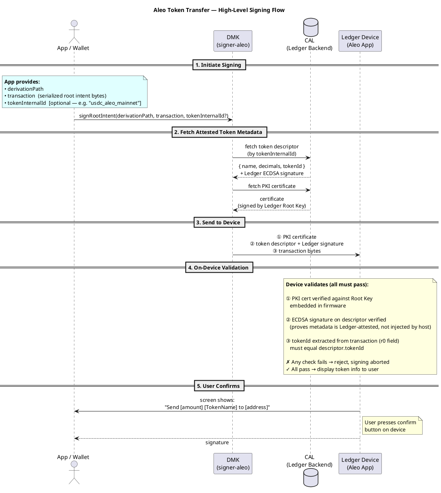
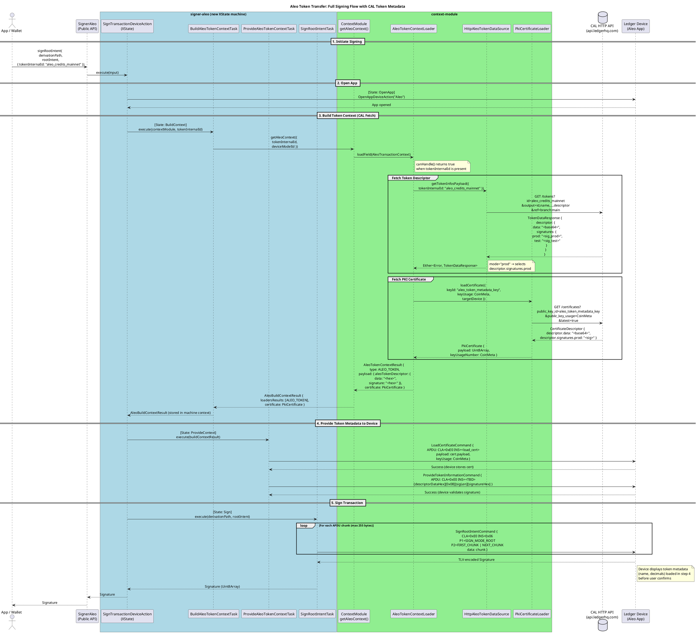

# Plan: CAL Token Metadata Integration for signer-aleo

## Context

The Ledger CAL (Crypto Asset List) service provides signed token descriptors that let the Ledger device display human-readable token info during signing (instead of raw hex). signer-solana already does this for SPL tokens via `ProvideTLVTransactionInstructionDescriptorCommand` + a context-module loader. The user wants to replicate this pattern in `signer-aleo`.

Currently, `signer-aleo` lists `@ledgerhq/context-module` as a dependency but **never uses it** — no binding in DI, no builder method, no tasks. The context-module's DI symbol (`ContextModule`) is declared in `externalTypes.ts` but unconnected.

---

## Known Unknowns (Must Resolve Before Coding)

Items marked ✅ are resolved. Items marked ⚠️ are partially answered. Items marked ❓ are still open blockers.

### ✅ 3. At what point in the signing flow does metadata need to be provided?

**Answer:** Only during `signRootIntent`. `signFeeIntent` and `signNestedCall` do not require token metadata.

This simplifies the implementation — only the `SignRootIntentDeviceAction` XState machine needs the Build/Provide context states.

---

### ✅ 4. How is the token identified in the transaction?

**Answer:** The caller passes `tokenInternalId` as an optional string parameter on `signRootIntent`. No transaction parsing is required on the host side.

For registry tokens (e.g. USDC on `token_registry.aleo`), the token is discriminated by the `r0` field in the transaction — but extracting this is the **firmware's responsibility**, not the host's. The host only needs to pass the signed descriptor; the device does the comparison. See [Security: Token Identity Binding](#security-token-identity-binding).

---

### ✅ 5. Should the metadata be sent once (per-signing session) or per-instruction?

**Answer (recommended):** Send **once per signing session**, immediately before the first `SignRootIntentCommand` chunk.

Rationale:
- An Aleo root intent is a single atomic unit — there is no multi-instruction stream that would require per-instruction metadata
- The device stores the descriptor in RAM for the duration of the active session
- Consistent with the Solana SPL pattern (one `ProvideTokenInformation` before signing begins)
- Re-sending per chunk would be redundant and would increase APDU traffic for no security gain

---

### ⚠️ 1. Firmware: Does the Aleo app have any token metadata INS code?

**Status:** Confirmed — **no such INS code exists yet** in the current Aleo firmware. The current app has exactly 4 instructions:
- `0x03` GET_APP_VERSION
- `0x05` GET_ADDRESS
- `0x06` SIGN_INTENT
- `0x07` GET_VIEW_KEY

A new `PROVIDE_TOKEN_INFORMATION` instruction (and `LOAD_CERTIFICATE` if not already present) must be added by the Aleo firmware team. **Outstanding questions for the firmware team:**
- What INS byte will they assign for token metadata?
- What is the full APDU format (CLA, INS, P1, P2, data layout)?
- Will they implement the `descriptor.tokenId == tx.r0` binding check described in the [Security](#security-token-identity-binding) section?

This remains a **hard blocker** for Phase 2 (the `ProvideTokenInformationCommand`).

---

### ⚠️ 2. What does Aleo token metadata look like on CAL?

**Status:** The CAL endpoint for Aleo tokens is **currently in progress**. Until it ships, assume the same structure as the Solana token endpoint:

```json
{
  "descriptor": {
    "data": "<base64-encoded TLV>",
    "signatures": {
      "prod": "<ECDSA sig>",
      "test": "<ECDSA sig>"
    }
  }
}
```

The `HttpAleoTokenDataSource` implementation should mirror `HttpSolanaTokenDataSource`. When the CAL endpoint finalises, verify the actual field names and adjust if needed.

---

## Implementation Plan (once unknowns are resolved)

### Overview

Follow the signer-solana pattern, adapted for Aleo. The work spans two packages:
- `packages/signer/context-module/` — new Aleo loader
- `packages/signer/signer-aleo/` — wire it into the signing flow

---

### Phase 1: Context-Module — Add Aleo Token Loader

**New files to create** (mirroring `context-module/src/solanaToken/`):

```
context-module/src/aleoToken/
├── data/
│   ├── AleoTokenDataSource.ts           # Interface
│   └── HttpAleoTokenDataSource.ts       # HTTP fetch from CAL
├── domain/
│   └── AleoTokenContextLoader.ts        # Core loader logic
└── di/
    ├── aleoTokenTypes.ts                # Inversify symbols
    └── aleoTokenModuleFactory.ts        # ContainerModule binding
```

**Reference:** `context-module/src/solanaToken/` — same 4-file pattern.

**Key files to modify:**

| File | Change |
|------|--------|
| `context-module/src/di.ts` | Add `aleoTokenModuleFactory()` to `makeContainer()` |
| `context-module/src/index.ts` | Export new Aleo types if needed publicly |
| `context-module/src/config/model/ContextModuleConfig.ts` | If Aleo needs config (CAL branch, chain_id) |

**`HttpAleoTokenDataSource`** will call:
```
GET ${CAL_URL}/tokens?id=${tokenId}&output=...&ref=branch:${branch}
```
(Same endpoint as Solana, different `chain_id` / token identifier — confirm with CAL team)

---

### Phase 2: signer-aleo — New Device Command

**New file:**
```
signer-aleo/src/internal/app-binder/command/ProvideTokenInformationCommand.ts
```

**Reference:** `signer-solana/src/internal/app-binder/command/ProvideTLVTransactionInstructionDescriptorCommand.ts`

Structure:
```typescript
// APDU: [dataHex][SIGNATURE_TAG][sigLen][signatureHex]
// INS: <TBD from firmware team>
```

Update `signer-aleo/src/internal/app-binder/command/utils/apduHeaderUtils.ts` to add the new INS code.

---

### Phase 3: signer-aleo — Build & Provide Context Tasks

**New files:**
```
signer-aleo/src/internal/app-binder/task/BuildAleoTokenContextTask.ts
signer-aleo/src/internal/app-binder/task/ProvideAleoTokenContextTask.ts
```

**Reference:**
- `signer-solana/src/internal/app-binder/task/BuildTransactionContextTask.ts`
- `signer-solana/src/internal/app-binder/task/ProvideSolanaTransactionContextTask.ts`

`BuildAleoTokenContextTask`:
1. Accepts `tokenId` (extracted from intent or passed via options)
2. Calls `contextModule.getAleoContext({ tokenId })` → new method on ContextModule
3. Returns PKI certificate + token descriptor data/signature

`ProvideAleoTokenContextTask`:
1. Calls `LoadCertificateCommand` with the PKI cert
2. Calls `ProvideTokenInformationCommand` with descriptor data + signature

---

### Phase 4: signer-aleo — Wire into Signing Flow

**Option A (Recommended): Convert to XState machine**

Create `signer-aleo/src/internal/app-binder/device-action/SignRootIntentDeviceAction.ts` (XState state machine, mirroring signer-solana's `SignTransactionDeviceAction.ts`):

States:
1. `OpenApp` → ensure Aleo app is open
2. `CheckIfTokenMetadataNeeded` → inspect intent for token id
3. `BuildContext` → `BuildAleoTokenContextTask` (conditional, skip if no token)
4. `ProvideContext` → `ProvideAleoTokenContextTask` (conditional)
5. `Sign` → existing `SignRootIntentTask`

~~**Option B (Simpler, lower risk): Add context steps in existing task**~~
Ignore that, we want to make it the quality way


Extend `SignRootIntentTask` to optionally call Build + Provide tasks before signing. Less ideal for complex flows but faster to implement.

---

### Phase 5: signer-aleo — Wire Builder & DI

**Files to modify:**

| File | Change |
|------|--------|
| `signer-aleo/src/api/SignerAleoBuilder.ts` | Add `withContextModule(cm: ContextModule): this` method (mirror signer-eth) |
| `signer-aleo/src/internal/di.ts` | Accept `contextModule` param, bind `ContextModule` symbol |
| `signer-aleo/src/internal/DefaultSignerAleo.ts` | Pass `contextModule` through to `makeContainer()` |

**Reference for builder pattern:**
- `signer-eth/src/api/SignerEthBuilder.ts` → `withContextModule()` method
- `signer-eth/src/internal/di.ts` → `container.bind<ContextModule>(externalTypes.ContextModule).toConstantValue(contextModule)`

---

### Phase 6: context-module — Add `getAleoContext()` to ContextModule interface

If Aleo uses the same pattern as Solana (dedicated method), add to:
- `context-module/src/ContextModule.ts` → add `getAleoContext(ctx: AleoTransactionContext): Promise<AleoTransactionContextResult>`
- `context-module/src/DefaultContextModule.ts` → implement it
- `context-module/src/ContextModuleBuilder.ts` → optionally expose `addAleoLoader()`

Alternatively, if Aleo token metadata fits the standard `ContextLoader<T>` pattern (like ETH tokens), it may slot into the existing `getContexts()` pipeline without a dedicated method.

---

---

### Phase 7: Firmware — Full Attested Token Metadata Flow

Implements the complete attested payload pipeline in `app-aleo/src/`. The PKI certificate is loaded and verified against Ledger's root key. The token descriptor is verified by ECDSA signature and its fields are stored in `G_context`. The stored metadata is **not yet used during signing** (no UI display, no `tokenId == r0` binding check) — those come after the CAL descriptor format is confirmed with the firmware team.

**Two new APDU commands:**

| Command | CLA | INS | P1 | Purpose |
|---------|-----|-----|----|---------|
| `CMD_LOAD_CERTIFICATE` | `0xB0` | `0x06` | `key_usage` (8 = CoinMeta) | Load and verify Ledger PKI certificate |
| `CMD_PROVIDE_TOKEN` | `0xE0` | `0x08` | `0x00` | Verify ECDSA-signed token descriptor, store metadata |

`CLA=0xB0` is the standard Ledger convention for PKI operations (matches the TypeScript `LoadCertificateCommand`). The Aleo app must accept it in addition to its own `CLA=0xE0`.

---

#### Step 1: `src/types.h` — add storage struct + new INS code

Add `CMD_PROVIDE_TOKEN` to `command_e`:

```c
typedef enum {
    CMD_GET_VERSION      = 0x03,
    CMD_GET_APP_NAME     = 0x04,
    CMD_GET_ADDRESS      = 0x05,
    CMD_SIGN_TRANSACTION = 0x06,
    CMD_GET_VIEW_KEY     = 0x07,
    CMD_PROVIDE_TOKEN    = 0x08,  /// receive attested token metadata
} command_e;
```

Add a new struct (above `global_ctx_t`):

```c
#define TOKEN_NAME_MAX_LEN 32

typedef struct {
    bool    valid;                       /* set to true after successful ECDSA verify */
    char    name[TOKEN_NAME_MAX_LEN + 1];
    uint8_t decimals;
    uint8_t token_id[32];               /* raw field_t bytes (little-endian BLS12-377) */
} token_metadata_t;
```

Add to the end of `global_ctx_t`:

```c
token_metadata_t token_metadata;
```

---

#### Step 2: `src/handler/load_certificate.h` + `.c` — new files

Calls `os_pki_load_certificate()` (BOLOS syscall, `os_pki.h`) which verifies the certificate chain back to the Ledger Root Key embedded in firmware.

**`load_certificate.h`:**
```c
#pragma once
#include "buffer.h"
int handler_load_certificate(buffer_t *cdata, uint8_t key_usage);
```

**`load_certificate.c`:**
```c
#include "ledger_assert.h"
#include "io.h"
#include "buffer.h"
#include "os_pki.h"
#include "globals.h"
#include "sw.h"
#include "load_certificate.h"

int handler_load_certificate(buffer_t *cdata, uint8_t key_usage)
{
    LEDGER_ASSERT(cdata != NULL, "NULL cdata");

    uint8_t                  trusted_name[CERTIFICATE_TRUSTED_NAME_MAXLEN] = {0};
    size_t                   trusted_name_len = sizeof(trusted_name);
    cx_ecfp_384_public_key_t public_key       = {0};

    bolos_err_t err = os_pki_load_certificate(
        key_usage,
        cdata->ptr + cdata->offset,
        cdata->size - cdata->offset,
        trusted_name,
        &trusted_name_len,
        &public_key);

    if (err != 0) {
        return io_send_sw((uint16_t) err);
    }

    PRINTF("Certificate loaded: key_usage=%u\n", (unsigned int) key_usage);
    return io_send_sw(SWO_SUCCESS);
}
```

`os_pki_load_certificate` returns the specific PKI error code (e.g., `0x5720` for bad signature, `0x4231` for expired) which is forwarded directly to the host.

---

#### Step 3: `src/apdu/dispatcher.c` — accept CLA=0xB0 + add CMD_PROVIDE_TOKEN case

Add includes at the top:
```c
#include "load_certificate.h"
#include "provide_token.h"
```

Insert **before** the existing `if (cmd->cla != CLA)` check:

```c
if (cmd->cla == 0xB0) {
    if (cmd->ins == 0x06) {
        if (!cmd->data) {
            return io_send_sw(SWO_WRONG_DATA_LENGTH);
        }
        buf.ptr    = cmd->data;
        buf.size   = cmd->lc;
        buf.offset = 0;
        return handler_load_certificate(&buf, cmd->p1);
    }
    return io_send_sw(SWO_INVALID_INS);
}
```

Add in the switch before `default:`:

```c
case CMD_PROVIDE_TOKEN:
    if (cmd->p1 != 0x00 || cmd->p2 != 0x00) {
        return io_send_sw(SWO_INCORRECT_P1_P2);
    }
    if (!cmd->data) {
        return io_send_sw(SWO_WRONG_DATA_LENGTH);
    }
    buf.ptr    = cmd->data;
    buf.size   = cmd->lc;
    buf.offset = 0;
    return handler_provide_token(&buf);
```

---

#### Step 4: `src/handler/provide_token.h` + `.c` — new files

**Descriptor wire format (proposal — confirm with CAL team when endpoint ships):**
```
[descriptor_data][0x15][sig_len: 1B][signature]
      ^            ^
      |            CERTIFICATE_TAG_SIGNATURE (splits data from sig)
      └── [name_len: u8][name: bytes][decimals: u8][token_id: 32B]
```

The handler:
1. Finds `0x15` tag to split descriptor from signature
2. SHA-256 hashes the descriptor bytes
3. Calls `check_signature_with_pki()` (`ledger_pki.h`) against the loaded CoinMeta key
4. Parses name / decimals / token_id from descriptor bytes
5. Stores in `G_context.token_metadata` (sets `valid = true`)

**`provide_token.h`:**
```c
#pragma once
#include "buffer.h"
int handler_provide_token(buffer_t *cdata);
```

**`provide_token.c`:**
```c
#include <stdint.h>
#include <stddef.h>
#include <string.h>

#include "ledger_assert.h"
#include "io.h"
#include "buffer.h"
#include "os_pki.h"
#include "ledger_pki.h"
#include "cx.h"

#include "globals.h"
#include "types.h"
#include "sw.h"
#include "provide_token.h"

#define SIGNATURE_TAG 0x15   /* CERTIFICATE_TAG_SIGNATURE */
#define TOKEN_ID_LEN  32     /* field_t = fp256_t = { uint64_t u64[4] } */

int handler_provide_token(buffer_t *cdata)
{
    LEDGER_ASSERT(cdata != NULL, "NULL cdata");

    const uint8_t *raw     = cdata->ptr + cdata->offset;
    size_t         raw_len = cdata->size - cdata->offset;

    /* 1. Locate 0x15 tag — everything before it is the signed descriptor */
    size_t descriptor_len = 0;
    while (descriptor_len < raw_len && raw[descriptor_len] != SIGNATURE_TAG) {
        descriptor_len++;
    }
    if (descriptor_len >= raw_len) {
        return io_send_sw(SWO_WRONG_DATA_LENGTH);
    }

    size_t         sig_start = descriptor_len + 1;  /* skip 0x15 */
    uint8_t        sig_len   = raw[sig_start];
    const uint8_t *sig       = raw + sig_start + 1;
    if (sig_start + 1 + sig_len > raw_len) {
        return io_send_sw(SWO_WRONG_DATA_LENGTH);
    }

    /* 2. Hash descriptor bytes (SHA-256) */
    uint8_t hash[CX_SHA256_SIZE];
    cx_hash_sha256(raw, descriptor_len, hash, sizeof(hash));

    /* 3. Verify ECDSA signature with loaded CoinMeta PKI key */
    uint8_t  expected_usage = CERTIFICATE_PUBLIC_KEY_USAGE_COIN_META;
    buffer_t hash_buf = {.ptr = hash,           .size = sizeof(hash), .offset = 0};
    buffer_t sig_buf  = {.ptr = (uint8_t *) sig, .size = sig_len,     .offset = 0};

    check_signature_with_pki_status_t pki_status =
        check_signature_with_pki(hash_buf, &expected_usage, NULL, sig_buf);

    if (pki_status != CHECK_SIGNATURE_WITH_PKI_SUCCESS) {
        PRINTF("PKI verify failed: %d\n", (int) pki_status);
        return io_send_sw(0x5720);  /* Failed to verify signature */
    }

    /* 4. Parse descriptor fields */
    buffer_t desc = {.ptr = (uint8_t *) raw, .size = descriptor_len, .offset = 0};

    uint8_t name_len = 0;
    if (!buffer_read_u8(&desc, &name_len) || name_len > TOKEN_NAME_MAX_LEN) {
        return io_send_sw(SWO_WRONG_DATA_LENGTH);
    }
    char token_name[TOKEN_NAME_MAX_LEN + 1] = {0};
    if (!buffer_read_bytes(&desc, (uint8_t *) token_name, name_len)) {
        return io_send_sw(SWO_WRONG_DATA_LENGTH);
    }
    uint8_t decimals = 0;
    if (!buffer_read_u8(&desc, &decimals)) {
        return io_send_sw(SWO_WRONG_DATA_LENGTH);
    }
    uint8_t token_id[TOKEN_ID_LEN] = {0};
    if (!buffer_read_bytes(&desc, token_id, TOKEN_ID_LEN)) {
        return io_send_sw(SWO_WRONG_DATA_LENGTH);
    }

    /* 5. Store in G_context — not yet used during signing */
    G_context.token_metadata.valid    = true;
    G_context.token_metadata.decimals = decimals;
    memcpy(G_context.token_metadata.name,     token_name, name_len + 1);
    memcpy(G_context.token_metadata.token_id, token_id,   TOKEN_ID_LEN);

    PRINTF("CMD_PROVIDE_TOKEN: PKI OK\n");
    PRINTF("  name:     %s\n", G_context.token_metadata.name);
    PRINTF("  decimals: %u\n", (unsigned int) decimals);
    PRINTF("  token_id: ");
    for (int i = 0; i < TOKEN_ID_LEN; i++) PRINTF("%02X", token_id[i]);
    PRINTF("\n");

    return io_send_sw(SWO_SUCCESS);
}
```

---

#### Key SDK references used

| Call | Header | Purpose |
|------|--------|---------|
| `os_pki_load_certificate()` | `os_pki.h` | Load and verify PKI cert against firmware root key |
| `check_signature_with_pki()` | `ledger_pki.h` | ECDSA verify with last-loaded PKI key |
| `cx_hash_sha256()` | `cx.h` | SHA-256 over descriptor bytes |
| `buffer_read_u8/bytes()` | `buffer.h` | Parse descriptor fields |
| `CERTIFICATE_PUBLIC_KEY_USAGE_COIN_META` | `os_pki.h` | = `0x08` — the key usage for token metadata |
| `CERTIFICATE_TAG_SIGNATURE` | `os_pki.h` | = `0x15` — TLV tag that separates data from signature |

---

#### Deferred (not blocked on CAL/firmware, but scoped out of this PoC)

| Feature | When to add |
|---------|-------------|
| `G_context.token_metadata.token_id == tx.r0` binding check in `sign_transaction.c` | After firmware team confirms binding approach (⚠️ Unknown #1) |
| Clear `token_metadata.valid` when a new signing session starts | Before signing display is wired up |
| UI display of token name / decimals on device screen | After binding check is in place |

---

## Critical File Reference Map

| Concern | Best Reference File |
|---------|---------------------|
| Token loader (data source) | `context-module/src/solanaToken/data/HttpSolanaTokenDataSource.ts` |
| Token loader (domain) | `context-module/src/solanaToken/domain/SolanaTokenContextLoader.ts` |
| DI types pattern | `context-module/src/solanaToken/di/tokenTypes.ts` |
| Module factory pattern | `context-module/src/solanaToken/di/tokenModuleFactory.ts` |
| Descriptor command (Solana) | `signer-solana/src/internal/app-binder/command/ProvideTLVTransactionInstructionDescriptorCommand.ts` |
| Build context task | `signer-solana/src/internal/app-binder/task/BuildTransactionContextTask.ts` |
| Provide context task | `signer-solana/src/internal/app-binder/task/ProvideSolanaTransactionContextTask.ts` |
| XState machine (signing) | `signer-solana/src/internal/app-binder/device-action/SignTransactionDeviceAction.ts` |
| Builder with ContextModule | `signer-eth/src/api/SignerEthBuilder.ts` |
| DI binding pattern | `signer-eth/src/internal/di.ts` |
| PKI certificate loading | `context-module/src/pki/domain/PkiCertificateLoader.ts` |
| CAL config model | `context-module/src/config/model/ContextModuleConfig.ts` |

---

## Verification / Testing Plan

1. **Unit tests** for `HttpAleoTokenDataSource` — mock HTTP, assert query params and response parsing
2. **Unit tests** for `AleoTokenContextLoader` — mock data source, assert `canHandle()` and `load()` outputs
3. **Unit tests** for `ProvideTokenInformationCommand` — assert correct APDU bytes
4. **Unit tests** for `BuildAleoTokenContextTask` and `ProvideAleoTokenContextTask` — mock context module and commands
5. **Integration test** for signing flow with mocked device — verify the full Build → Provide → Sign sequence

Existing tests to reference:
- `context-module/src/solanaToken/__tests__/`
- `signer-solana/src/internal/app-binder/command/__tests__/ProvideTLVTransactionInstructionDescriptorCommand.test.ts`

---

## signer-eth vs signer-solana: Context Module Comparison

The data flow is conceptually identical in both signers — fetch metadata from CAL, load PKI cert, send `LoadCertificateCommand` to device, send context-specific APDU, then sign. The difference is **scale and dynamism**.

### Context types: 18 vs 2

| Signer | Types | What they cover |
|--------|-------|-----------------|
| **ETH** | 18 | `TOKEN`, `NFT`, `PLUGIN`, `EXTERNAL_PLUGIN`, `TRUSTED_NAME`, `TRANSACTION_INFO`, `PROXY_INFO`, `ENUM`, `TRANSACTION_FIELD_DESCRIPTION`, `TRANSACTION_CHECK`, `DYNAMIC_NETWORK`, `DYNAMIC_NETWORK_ICON`, `GATED_SIGNING`, `SAFE`, `SIGNER`, `ACCOUNT_OWNERSHIP`, `ERROR`, `DYNAMIC_NETWORK_ICON` |
| **Solana** | 2 | `SOLANA_TOKEN`, `SOLANA_LIFI` |

ETH needs this breadth because any EVM smart contract call can involve ERC-20s, ERC-721s, ENS names, external dApp plugins, proxy contracts, safe accounts, and gated signing all in the same transaction. Solana (and Aleo) transactions are more structured.

### CAL endpoints: many vs few

| Signer | Endpoints used |
|--------|---------------|
| **ETH** | `/tokens`, `/nfts`, `/dapps`, `/descriptors_calldata`, `/descriptors_token`, `/v2/names/ethereum/{chainId}/reverse/{addr}`, `/v2/names/ethereum/{chainId}/forward/{domain}`, `/v2/concordium/owner/...`, `/certificates` |
| **Solana** | `/tokens`, `/swap_templates`, `/certificates` |

### Context loading: lazy vs eager

- **ETH — lazy**: `BuildFullContextsTask` creates *callbacks* (closures) for each subcontext, but does not execute them. The callbacks execute during `ProvideContextsTask`, immediately before the APDU is sent. This allows challenge fetches to happen per-subcontext on demand.
- **Solana — eager**: `BuildTransactionContextTask` fetches everything upfront in one pass. All data is in memory before `ProvideContextTask` begins.

### Nesting: recursive vs flat

ETH supports **nested calldata** — a transaction field can contain another transaction's calldata, which must be parsed and have its own context built recursively. Solana (and Aleo) have no equivalent.

### APDU command structure: per-type INS vs unified TLV

| Signer | Pattern |
|--------|---------|
| **ETH** | One dedicated `INS` per context type: TOKEN=`0x0A`, NFT=`0x14`, TRUSTED_NAME=`0x22`, TRANSACTION_INFO=`0x26`, ENUM=`0x24`, PROXY_INFO=`0x2A`, GATED_SIGNING=`0x38`, … |
| **Solana** | Unified TLV: one `INS=0x22` for all token/swap descriptors, with the descriptor type encoded in the TLV data itself |

### ContextModule API: generic dispatch vs dedicated method

```typescript
// ETH — generic, filter-based batch dispatch
contextModule.getContexts(
  { to, data, chainId, challenge, deviceModelId },
  [TOKEN, NFT, TRUSTED_NAME, PROXY_INFO, ...]   // filter types
)
// Returns: ClearSignContext[] — may include multiple types from one call

// Solana — dedicated, type-safe method
contextModule.getSolanaContext({ tokenInternalId, templateId, deviceModelId })
// Returns: Either<Error, SolanaTransactionContextResult>
```

### Task count

| Signer | Tasks |
|--------|-------|
| **ETH** | ~12: `ParseTransaction`, `BuildBaseContexts`, `BuildFullContexts`, `BuildSubcontexts`, `ParseNestedTransaction`, `ProvideTransactionContexts`, `ProvideContext`, `ProvideEIP712Context`, `SendCommandInChunks`, `BlindSigningDetection`, `BuildSafeAddressContext`, `BuildEIP712Context` |
| **Solana** | 3: `BuildTransactionContext`, `ProvideSolanaTransactionContext`, `SignData` |

### What this means for Aleo

Aleo should follow the **Solana pattern** (not ETH). Aleo's token model is simpler than EVM, and the signing modes (`signRootIntent`, `signFeeIntent`, `signNestedCall`) are already structurally defined. The right approach is:
- A dedicated `getAleoContext()` method on `ContextModule`
- 1–2 Aleo-specific context loaders
- Eager loading (no lazy callbacks)
- A single `ProvideTokenInformationCommand` (TBD INS from firmware team)
- Same `LoadCertificateCommand` (CLA=`0xB0`, INS=`0x06`) as all other signers

---

## How PKI Certificates Work

### What the "certificate" actually is

This is **not** an X.509/TLS certificate. It is a **signed attestation** from Ledger's backend — a TLV blob where:
- `data` = the token descriptor (name, ticker, decimals, contract address, serialized as TLV)
- `signature` = Ledger's ECDSA signature over that data, produced offline in Ledger's HSM

The problem it solves: the device cannot trust the host machine (it may be compromised). Without the certificate, malware on the host could replace "USDC" with "SAFE_TOKEN" while actually draining funds. The device only displays metadata that Ledger's backend has cryptographically attested.

---

### The math: ECDSA

**Offline, on Ledger's CAL backend:**
```
descriptor_bytes = TLV-serialized(name, ticker, decimals, contract_address)
private_key      = aleo_token_metadata_key  ← never leaves Ledger's HSM
hash             = SHA-256(descriptor_bytes)
(r, s)           = ECDSA_sign(hash, private_key)
                   → stored in CAL as descriptor.signatures.prod / .test
```

**On-device when `LoadCertificateCommand` is received:**
```
device has:     aleo_token_metadata_key PUBLIC key (certified by Ledger Root, in firmware ROM)
device parses:  [descriptor_bytes][0x15][sig_len][r||s]
device checks:  ECDSA_verify(SHA256(descriptor_bytes), signature, public_key)
  → true (0x9000) : metadata stored in RAM, displayed during signing
  → false (0x5720): "Failed to verify signature" → signing aborted
```

---

### The two-level trust chain

```
Ledger Root Key (burned into firmware ROM, never leaves HSM)
    └── Purpose-specific subkeys, each certified by root:
          CoinMeta     (P1=8)  → verifies token descriptor signatures
          NftMeta      (P1=3)  → verifies NFT descriptor signatures
          TrustedName  (P1=4)  → verifies domain / address name bindings
          SwapTemplate (P1=13) → verifies swap route descriptors
          GatedSigning (P1=15) → ...
```

`LoadCertificateCommand(P1 = keyUsageNumber)` tells the device which purpose slot to load into. The device first verifies the subkey certificate against its root key, then uses the validated subkey for all subsequent descriptor verification in that session.

---

### APDU byte layout

```
LoadCertificateCommand APDU:
  CLA=0xB0  INS=0x06  P1=8 (CoinMeta)  P2=0x00
  Data: [descriptor_bytes...] [0x15] [sig_len] [signature_bytes...]
             ↑ attested metadata   ↑ SIGNATURE_TAG (TLV separator, value 0x15)
```

Everything before `0x15` is the attested data; everything after is the DER-encoded ECDSA signature. If verify passes → `0x9000 (Success)`. If not → `0x5720 (Failed to verify signature)`.

Other relevant error codes from the firmware:
| Code | Meaning |
|------|---------|
| `0x4231` | Certificate has expired (`not_valid_after` exceeded) |
| `0x4235` | Unknown public key ID (`keyId` not recognized by firmware) |
| `0x4236` | Unknown public key usage (P1 value out of range) |
| `0x422e` | `keyUsage` in cert doesn't match the P1 sent |
| `0x5720` | ECDSA signature verification failed |

---

### Why fetch the certificate every time?

Three reasons:

1. **Expiry** — CAL returns `not_valid_after` in every response. Ledger rotates subkeys periodically. Fetching with `latest=true` always returns the currently-valid cert without local expiry tracking.

2. **Device RAM is volatile** — The cert is stored only during the active signing session. App restart, USB reconnect, or power cycle wipes it. The host must re-send it at the start of every session.

3. **Stateless context-module** — The context-module has no persistent local cache by design. One extra HTTP call per session trades latency for safety against serving a rotated or expired cert from a stale cache.

---

## Security: Token Identity Binding

### The threat

`tokenInternalId` is an optional parameter supplied by the calling app. A malicious or buggy app could pass `tokenInternalId: "usdc_aleo_mainnet"` while the actual transaction transfers a completely different token. Without a binding check, the device would show "USDC" metadata while signing a transfer of a different asset.

### Aleo-specific nuance: token_registry.aleo

Aleo has two token models:

| Model | Token discriminator | Example |
|-------|---------------------|---------|
| Native program token | `program_id` | `credits.aleo` → ALEO Credits |
| Token registry token | `tokenId` field (r0 parameter) | `token_registry.aleo` + `r0=<field>` → USDC, USDT, … |

The `transfer_public` function on `token_registry.aleo` takes:
```
input r0 as field.public;   ← tokenId (discriminates the actual token)
input r1 as address.public; ← recipient
input r2 as u128.public;    ← amount
```

For registry tokens the program ID alone is not enough — `r0` is what identifies the specific token.

### Agreed solution: device-side binding verification

The host (DMK) fetches token metadata from CAL using the caller-supplied `tokenInternalId` — this is a **fetch hint**, not a trusted input. Security is enforced entirely on the device:

1. The CAL descriptor for a token includes the on-chain `tokenId` as an **attested field** (inside the ECDSA-signed blob, not a sidecar).
2. The device independently parses the transaction it receives and extracts `r0`.
3. Before displaying anything to the user, the device checks: `descriptor.tokenId == tx.r0`.
4. If mismatch → reject, signing aborted. The user never sees a confirmation screen.

**This must be confirmed with the Aleo firmware team** — see Known Unknown #1. The firmware must implement steps 2–4 for the feature to be secure.

### Attack surface

| Attack | Stopped by |
|--------|-----------|
| Caller passes wrong `tokenInternalId` | Device rejects: descriptor.tokenId ≠ tx.r0 |
| Malware swaps `tokenInternalId` before CAL fetch | Device rejects: same check |
| Malware replaces descriptor bytes in transit | ECDSA signature verification fails on device |
| Malware replaces transaction bytes after parsing | Device shows what it's actually signing |

---

## High-Level Flow Overview

The diagram below shows the end-to-end flow from the app's perspective — what it provides, what Ledger's backend attests, and what the device enforces.



---

## Data Flow Diagram

The diagram below shows the full proposed data flow for signing an Aleo token transfer, from the calling app through signer-aleo and context-module to the CAL HTTP API and finally to the Ledger device.


