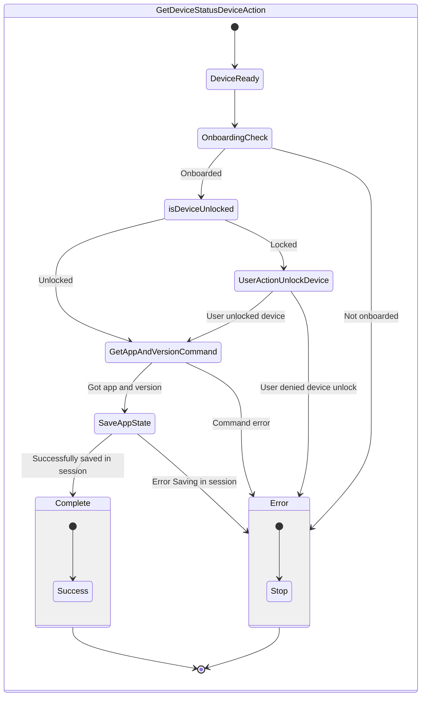
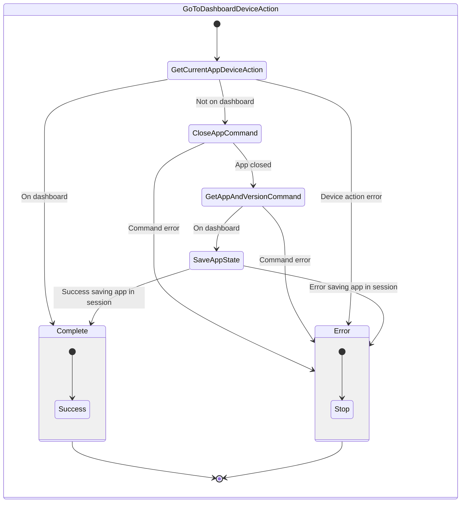
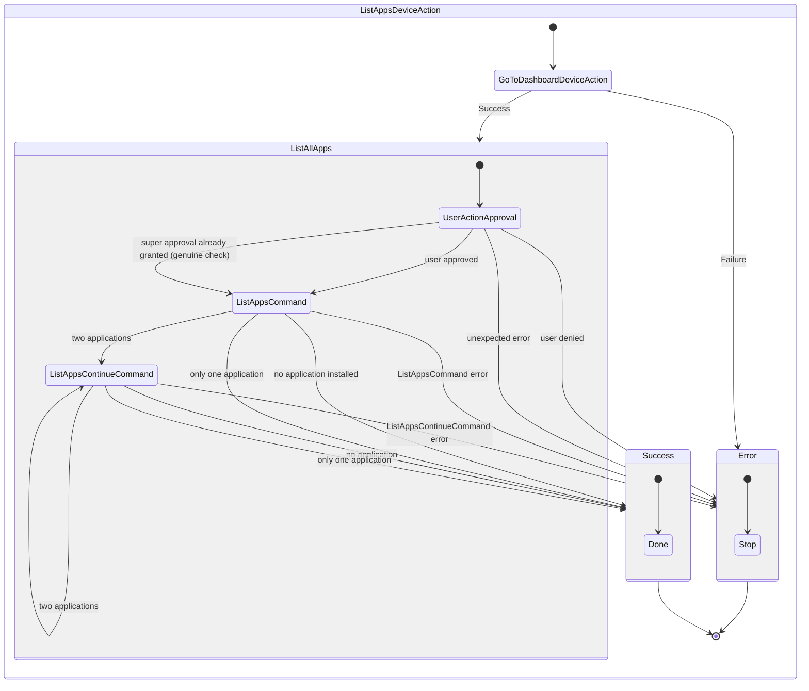
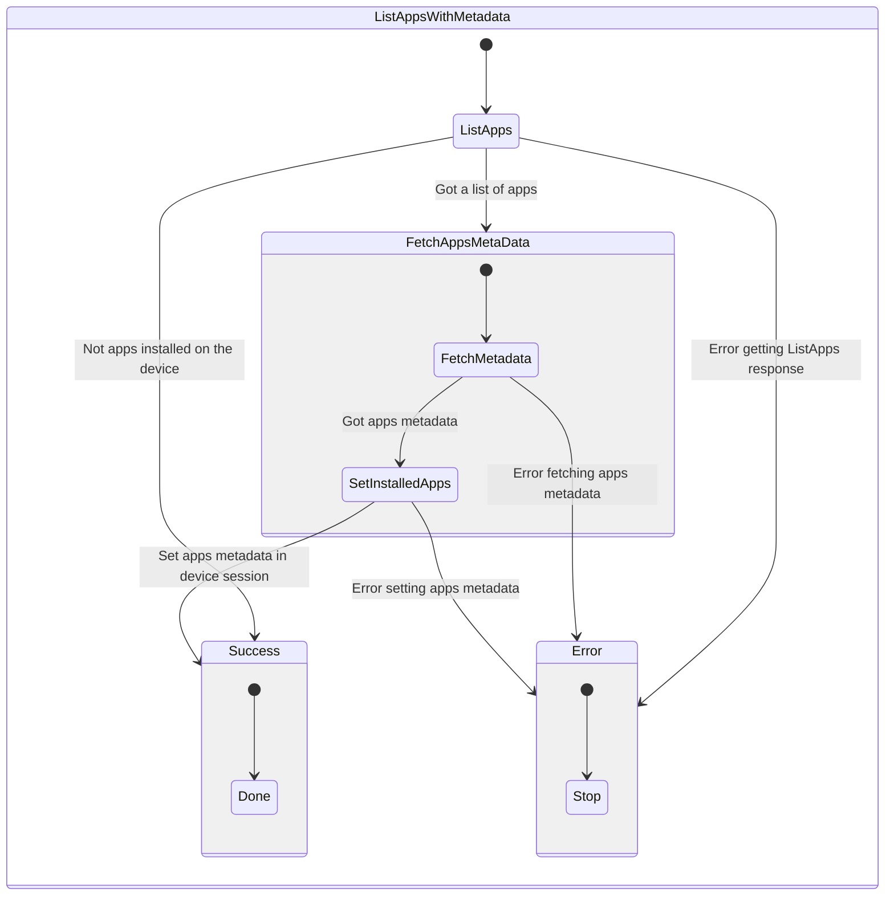
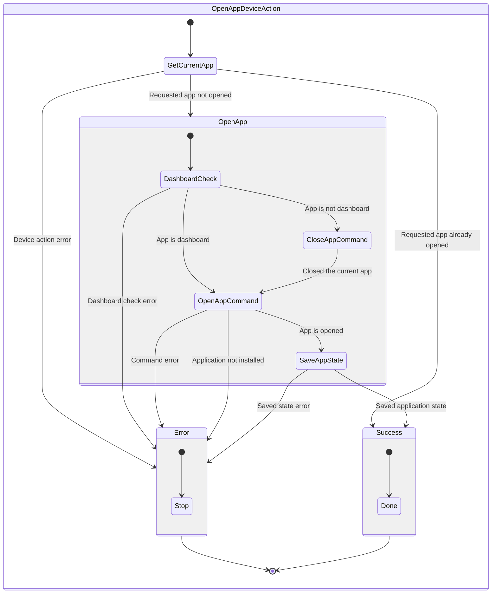

# Device Actions

List of device actions state flows.

# OS Level Device Actions

## Get Device Status

Check for device availability and returns CurrentApp

### Inputs

- unlockTimeout \[number\] _(optional)_

### Outputs

- Opened application (or BOLOS for Dashboard)

## GoToDashboardDeviceAction

Sanity check or action to return to the Dashboard for OS level commands / actions

### Inputs

- unlockTimeout \[number\] _(optional)_

### Outputs

none

## ListAppsDeviceAction

Returns a list of installed applications on the device

### Inputs

- unlockTimeout \[number\] _(optional)_

### Outputs

- Applications

## ListAppsWithMetadata

Returns a list of installed application on the device and their metadata

### Inputs

- unlockTimeout \[number\] _(optional)_

### Outputs

- Applications installed and their metadata

## OpenAppDeviceAction

Checks for an installed app on the device an opens it

### Inputs

- AppName
- Device session

### Outputs

- Opened application

