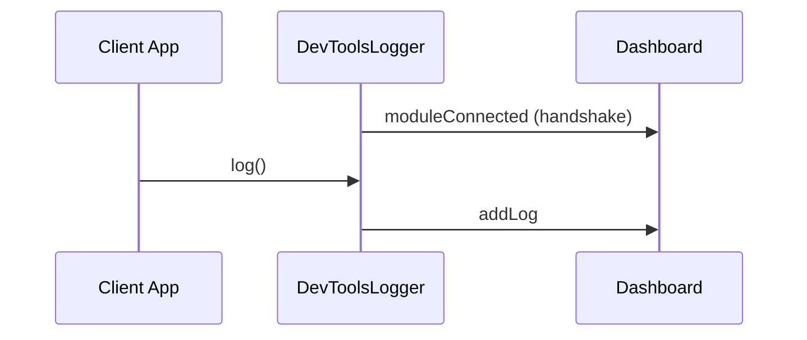
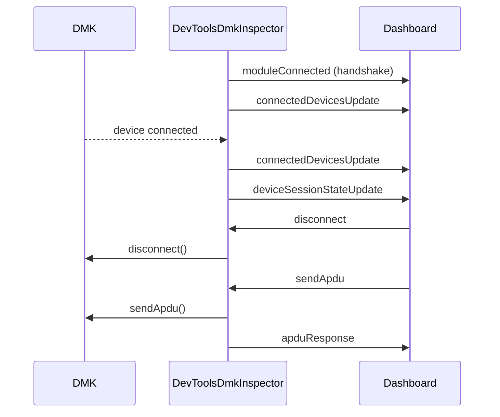

# Device Management Kit DevTools Core

Core library for DMK developer tools. Contains:

- **`DevToolsLogger`** — Relays DMK logs to the devtools dashboard
- **`DevToolsDmkInspector`** — Enables device session inspection and DMK interaction from the dashboard

## Getting Started

Choose the setup that matches your app:

- **Web, Node.js, Electron or React Native app** → [WebSocket devtools setup](../device-management-kit/README.md#web-nodejs-or-electron-app)
- **React Native app with Rozenite** → [Rozenite devtools setup](../device-management-kit/README.md#react-native-app-with-rozenite) _(recommended for RN — better DX, less setup)_

## Architecture

The devtools system provides a bi-directional communication bridge between a client app (hosting the DMK) and a "Dashboard" app where the developer tools UI is displayed.


### Packages

| Package                        | Description                                                                                      |
| ------------------------------ | ------------------------------------------------------------------------------------------------ |
| `devtools-core`                | Core types, `DevToolsLogger` for logging, and `DevToolsDmkInspector` for session/DMK interaction |
| `devtools-ui`                  | React component for the devtools dashboard UI                                                    |
| `devtools-rozenite`            | Connector for React Native apps using [Rozenite](https://www.rozenite.dev/)                      |
| `devtools-websocket-common`    | Common types and constants for the WebSocket layer                                               |
| `devtools-websocket-connector` | WebSocket connector implementation for client apps                                               |
| `devtools-websocket-server`    | Node WebSocket server that relays messages between client and dashboard                          |

### Dashboard Implementations

There are two dashboard implementations:

- **Rozenite** (for React Native apps): The devtools appear directly in the React Native DevTools
- **Electron** (for all other platforms): A standalone desktop app (`apps/devtools`)

### Module Architecture

#### Connector Interface

Both `DevToolsLogger` and `DevToolsDmkInspector` communicate with the dashboard through a `Connector` interface:

```ts
interface Connector {
  sendMessage: (type: string, payload: string) => void;
  listenToMessages: (listener: (type: string, payload: string) => void) => {
    unsubscribe: () => void;
  };
}
```

This interface is implemented by:

- `DevtoolsWebSocketConnector` — for web, Node.js, Electron, and React Native apps
- `RozeniteConnector` — for React Native apps using Rozenite

#### Module Handshake

When a module is instantiated, it sends a `moduleConnected` message to identify itself to the dashboard. This allows the dashboard UI to show connection status for each module and conditionally render UI elements.

#### DevToolsLogger Protocol

`DevToolsLogger` provides **one-way communication** from the client app to the dashboard for log streaming.



| Direction          | Message Type      | Payload                                                                |
| ------------------ | ----------------- | ---------------------------------------------------------------------- |
| Client → Dashboard | `moduleConnected` | `{ module: "logger" }`                                                 |
| Client → Dashboard | `addLog`          | `DevToolsLog` object (timestamp, tag, verbosity, message, payloadJSON) |

#### DevToolsDmkInspector Protocol

`DevToolsDmkInspector` provides **bi-directional communication** for device session inspection and DMK interaction.



**Messages from Inspector to Dashboard:**

| Message Type               | Payload                                              | Description                              |
| -------------------------- | ---------------------------------------------------- | ---------------------------------------- |
| `moduleConnected`          | `{ module: "dmk-inspector" }`                        | Handshake                                |
| `connectedDevicesUpdate`   | `ConnectedDevice[]`                                  | List of all connected devices            |
| `deviceSessionStateUpdate` | `{ sessionId, state }`                               | Session state change                     |
| `providerValue`            | `{ provider: number }`                               | Response to getProvider                  |
| `apduResponse`             | `{ requestId, success, statusCode?, data?, error? }` | Response to sendApdu                     |
| `discoveredDevicesUpdate`  | `DiscoveredDevice[]`                                 | List of available devices for connection |

**Commands from Dashboard to Inspector:**

| Command Type            | Payload                          | Description                                         |
| ----------------------- | -------------------------------- | --------------------------------------------------- |
| `disconnect`            | `{ sessionId }`                  | Disconnect a device session                         |
| `sendApdu`              | `{ sessionId, apdu, requestId }` | Send raw APDU to device                             |
| `getProvider`           | —                                | Request current provider value                      |
| `setProvider`           | `{ provider: number }`           | Set provider value                                  |
| `startListeningDevices` | —                                | Start listening for available devices (passive)     |
| `stopListeningDevices`  | —                                | Stop listening for available devices                |
| `startDiscovering`      | —                                | Start active discovery (triggers permission prompt) |
| `stopDiscovering`       | —                                | Stop active discovery                               |
| `connectDevice`         | `{ deviceId }`                   | Connect to a discovered device                      |

#### Lifecycle

- **`DevToolsLogger`** — Instantiated _before_ DMK is built, then passed to `DeviceManagementKitBuilder.addLogger()`
- **`DevToolsDmkInspector`** — Instantiated _after_ DMK is built, requires the DMK instance
- Both modules should share the same `Connector` instance
- Call `DevToolsDmkInspector.destroy()` to clean up subscriptions when done

### Features

- [x] **Real-time log display** — View all DMK logs in real-time with verbosity levels and tags

  - _Module: `DevToolsLogger`_

- [x] **Device sessions inspector** — Display all connected device sessions and their live states

  - List all active device sessions with device info (model, name, connection type)
  - Show live `DeviceSessionState` for each session (status, battery, current app, OS info)
  - _Module: `DevToolsDmkInspector`_

- [x] **Device session actions** — Interact with device sessions from the dashboard

  - Disconnect a device session
  - Send raw APDU commands to a session (backend ready, UI pending)
  - _Module: `DevToolsDmkInspector`_

- [x] **DMK configuration** — View and modify DMK settings

  - View and set the Manager API provider (`getProvider` / `setProvider`) (backend ready, UI pending)
  - _Module: `DevToolsDmkInspector`_

- [x] **Device discovery** — Discover and connect to devices from the dashboard

  - Start/stop device discovery
  - View list of available devices
  - Connect to a discovered device
  - _Module: `DevToolsDmkInspector`_

- [ ] **Advanced logging** — Enhanced log viewing experience
  - Filter by log level, tag, or content
  - Log context visualization (expand/collapse structured data)
  - Export logs
  - _Module: `DevToolsLogger`_
