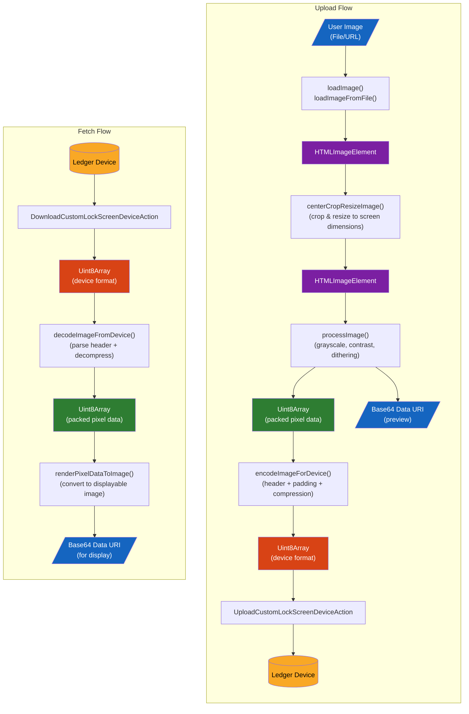
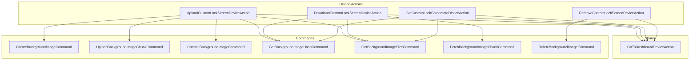

# Custom Lock Screen

This module provides device actions and utils for managing custom lock screen images on Ledger devices.

## Overview

Custom Lock Screen (CLS) allows users to personalize their Ledger device by uploading a custom image that displays on the lock screen. These device actions handle the complete lifecycle:

- **Upload**: Upload and set a new custom lock screen image
- **Download**: Retrieve the current custom lock screen image from the device
- **Get Info**: Query whether a custom lock screen exists and get its metadata (size, hash)
- **Remove**: Delete the custom lock screen image from the device

All device actions automatically ensure the device is on the dashboard before performing CLS operations.

## Device Actions

### UploadCustomLockScreenDeviceAction

Uploads a custom lock screen image to the device. Handles chunked upload with progress reporting and requires user confirmation on the device.

[View full documentation](../src/api/device-action/UploadCustomLockScreen/README.md)

### DownloadCustomLockScreenDeviceAction

Retrieves the current custom lock screen image from the device. Supports backup hash comparison to skip download if image hasn't changed.

[View full documentation](../src/api/device-action/DownloadCustomLockScreen/README.md)

### GetCustomLockScreenInfoDeviceAction

Gets information about the custom lock screen on the device without downloading the image data. Returns whether a custom lock screen exists, and if so, its size in bytes and hash.

[View full documentation](../src/api/device-action/GetCustomLockScreenInfo/README.md)

### RemoveCustomLockScreenDeviceAction

Removes the custom lock screen image from the device. Requires user confirmation on the device.

[View full documentation](../src/api/device-action/RemoveCustomLockScreen/README.md)

---

## Image Data Format

The `imageData` passed to `UploadCustomLockScreenDeviceAction` must be in a specific binary format expected by the device. This section documents the complete data structure.

### Overview

```
┌─────────────────────────────────────────────────────────────────┐
│                        IMAGE DATA                               │
├──────────────────────┬──────────────────────────────────────────┤
│      HEADER          │           COMPRESSED DATA                │
│      (8 bytes)       │         (variable length)                │
└──────────────────────┴──────────────────────────────────────────┘
```

### Header Structure (8 bytes)

| Offset | Size    | Field        | Encoding      | Description                         |
| ------ | ------- | ------------ | ------------- | ----------------------------------- |
| 0      | 2 bytes | `width`      | Little-endian | Image width in pixels               |
| 2      | 2 bytes | `height`     | Little-endian | Image height in pixels              |
| 4      | 1 byte  | `flags`      | -             | `(bpp << 4) \| compression`         |
| 5      | 3 bytes | `dataLength` | Little-endian | Length of the data section in bytes |

#### Flags Byte (offset 4)

The flags byte encodes two values:

- **Bits 4-7 (high nibble)**: BPP indicator
  - `0` = 1 bit per pixel (black & white)
  - `2` = 4 bits per pixel (16 gray levels)
- **Bits 0-3 (low nibble)**: Compression
  - `0` = No compression
  - `1` = Gzip compression (recommended)

Example: For 4bpp with compression: `(2 << 4) | 1 = 0x21`

### Compressed Data Section

When compression is enabled (`compression = 1`), the image data is processed as follows:

1. **Chunking**: Raw pixel data is split into 2048-byte chunks
2. **Compression**: Each chunk is individually gzip-compressed
3. **Prefixing**: Each compressed chunk is prefixed with its 2-byte size (little-endian)

```
┌────────────────────────────────────────────────────────────────┐
│                    COMPRESSED DATA SECTION                     │
├─────────────────────┬─────────────────────┬────────────────────┤
│   CHUNK 1           │   CHUNK 2           │   CHUNK N...       │
├──────────┬──────────┼──────────┬──────────┼──────────┬─────────┤
│ Size (2B)│ GZip Data│ Size (2B)│ GZip Data│ Size (2B)│GZip Data│
└──────────┴──────────┴──────────┴──────────┴──────────┴─────────┘
```

### Raw Pixel Data Format

Before compression, the raw pixel data has the following structure:

#### Pixel Order

Pixels are stored **column by column**, starting from the **right edge** and moving left:

- Start at top-right corner
- Go down the column (top to bottom)
- Move to the next column (right to left)
- End at bottom-left corner

```
Column order:  ... ← 3 ← 2 ← 1 ← 0 (rightmost)

For each column:
  ↓ Row 0 (top)
  ↓ Row 1
  ↓ ...
  ↓ Row N (bottom)
```

#### Pixel Encoding

**4 bits per pixel (16 gray levels)**:

- Each hex character represents one pixel (0-15)
- `0` = black, `f` = white

**1 bit per pixel (black & white)**:

- 4 pixels packed per hex character
- Bits are packed MSB first
- Color is inverted: `1` = black, `0` = white

### Screen Specifications

| Device | Data Width | Data Height | Visible Width | Visible Height | BPP | Notes              |
| ------ | ---------- | ----------- | ------------- | -------------- | --- | ------------------ |
| Stax   | 400        | 672         | 400           | 670            | 4   | 2px bottom padding |
| Flex   | 480        | 600         | 480           | 600            | 4   | No padding         |
| Apex   | 300        | 400         | 300           | 400            | 1   | No padding         |

**Important**: When preparing images, use the **visible dimensions** (e.g., 400x670 for Stax), not the full data dimensions. The `encodeImageForDevice` function will add padding automatically.

Use `getScreenVisibleAreaDimensions(deviceModelId)` to get the correct dimensions for image preparation.

### Padding

Some devices have non-visible padding areas. The image data sent to the device must include these padding areas filled with zeros:

- **Stax**: 2 pixels of bottom padding per column
- **Flex/Apex**: No padding required

The `padImage` parameter in `encodeImageForDevice` controls whether padding is added:

- **`padImage: true`** (default) - Use for fresh images processed from user input (visible area dimensions, e.g., 400x670 for Stax). Padding is automatically added.
- **`padImage: false`** - Use for images fetched from the device via `DownloadCustomLockScreenDeviceAction`, which already include padding (full screen dimensions, e.g., 400x672 for Stax).

### Using encodeImageForDevice

The `encodeImageForDevice` utility function handles all the formatting:

```typescript
import {
  centerCropResizeImage,
  encodeImageForDevice,
  getScreenSpecs,
  getScreenVisibleAreaDimensions,
  loadImage,
  processImage,
} from "@ledgerhq/dmk-ledger-wallet";

const deviceModelId = "stax"; // or "flex", "apex"
const screenSpecs = getScreenSpecs(deviceModelId);

// 1. Crop/resize the source image to VISIBLE AREA dimensions (not full screen)
// For Stax: 400x670, for Flex: 480x600, for Apex: 300x400
const visibleDimensions = getScreenVisibleAreaDimensions(deviceModelId);
const croppedResult = await centerCropResizeImage(
  sourceImageUri,
  visibleDimensions,
);

// 2. Load the cropped image and process it (grayscale, dithering)
const imageElement = await loadImage(croppedResult.imageBase64DataUri);
const result = processImage({
  image: imageElement,
  contrast: 1.0,
  bitsPerPixel: screenSpecs.bitsPerPixel,
  ditheringAlgorithm: "floyd-steinberg",
});

// 3. Encode for device (with header + padding + optional compression)
// This adds padding to convert from visible area to full screen dimensions
const formattedData = await encodeImageForDevice({
  pixelData: result.rawResult.pixelData,
  compress: true,
  padImage: true, // true for fresh images, false for images fetched from device
  screenSpecs,
});

// 4. Use with device action
const deviceAction = new UploadCustomLockScreenDeviceAction({
  input: { imageData: formattedData },
});
```

### Complete Binary Example

For a small 4x4 image on a 4bpp device:

```
Header (8 bytes):
  04 00        - width = 4 (LE)
  04 00        - height = 4 (LE)
  21           - flags: bpp=2 (4bpp), compression=1
  XX XX XX     - dataLength (3 bytes, LE)

Compressed Data:
  YY YY        - chunk 1 size (2 bytes, LE)
  [gzip data]  - gzip-compressed pixel data
```

---

### Image Processing Pipeline

The following diagram shows the complete data flow for uploading and fetching custom lock screen images:



#### Data Formats at Each Stage

| Stage              | Format                | Description                                                                       |
| ------------------ | --------------------- | --------------------------------------------------------------------------------- |
| User Image         | File / URL            | Original image in any common format (PNG, JPG, etc.)                              |
| After load         | `HTMLImageElement`    | Loaded image element ready for canvas operations                                  |
| After crop/resize  | `HTMLImageElement`    | Image cropped and resized to **visible area** dimensions (e.g., 400x670 for Stax) |
| After processImage | `Uint8Array` + Base64 | Packed pixel data for device + preview image for display                          |
| Device format      | `Uint8Array`          | 8-byte header + padding + optional gzip compression                               |
| For display        | Base64 Data URI       | Grayscale image ready for HTML `` element                                    |

#### Web Runtime Requirement

The image processing utilities (`loadImageFromFile`, `centerCropResizeImage`, `processImage`, `renderPixelDataToImage`) require a **Web runtime environment** (browser) as they use Web APIs such as Canvas, Image, and FileReader.

The codec utilities (`encodeImageForDevice`, `decodeImageFromDevice`) and screen spec utilities (`getScreenSpecs`, `getScreenVisibleAreaDimensions`, `isCustomLockScreenSupported`) work in any JavaScript runtime (Node.js, Hermes, browser, etc.).

---

## Error Handling

All CLS device action errors are remapped to DA (Device Action) error types for consistent error handling. Each device action has a **narrow error type** that only includes errors possible from its underlying commands. Errors can be identified via `instanceof` checks.

### Error Types by Device Action

Each DA has a specific error type union based on its underlying commands:

**`DownloadCustomLockScreenDAError`** (uses GetHash, GetSize, Fetch commands):

| Error Type                                | Error Codes | Description                  |
| ----------------------------------------- | ----------- | ---------------------------- |
| `NoCustomLockScreenImageDAError`          | `662e`      | No image exists on device    |
| `DeviceInRecoveryModeDAError`             | `662f`      | Device is in recovery mode   |
| `InvalidCustomLockScreenImageDataDAError` | `6832`      | Invalid chunk size requested |
| `GoToDashboardDAError`                    | Various     | Failed to reach dashboard    |
| `UnknownDAError`                          | Fallback    | Unexpected errors            |

**`GetCustomLockScreenInfoDAError`** (uses GetSize, GetHash commands):

| Error Type                    | Error Codes | Description                |
| ----------------------------- | ----------- | -------------------------- |
| `DeviceInRecoveryModeDAError` | `662f`      | Device is in recovery mode |
| `GoToDashboardDAError`        | Various     | Failed to reach dashboard  |
| `UnknownDAError`              | Fallback    | Unexpected errors          |

Note: When there is no image on the device, GetSize returns `size=0` (per spec), which results in a successful `{ hasCustomLockScreen: false }` output. Error code `662e` is also handled as a fallback.

**`UploadCustomLockScreenDAError`** (uses Create, Load, Commit commands):

| Error Type                                | Error Codes                    | Description                        |
| ----------------------------------------- | ------------------------------ | ---------------------------------- |
| `RefusedByUserDAError`                    | `5501`                         | User refused on device             |
| `DeviceInRecoveryModeDAError`             | `662f`                         | Device is in recovery mode         |
| `InvalidCustomLockScreenStateDAError`     | `5106`, `551e`                 | CLS commands called in wrong order |
| `InvalidCustomLockScreenImageDataDAError` | `6703`, `680b`, `681f`, `6820` | Invalid image data                 |
| `GoToDashboardDAError`                    | Various                        | Failed to reach dashboard          |
| `UnknownDAError`                          | Fallback                       | Unexpected errors                  |

**`RemoveCustomLockScreenDAError`** (uses Delete command):

| Error Type                                   | Error Codes | Description                |
| -------------------------------------------- | ----------- | -------------------------- |
| `RefusedByUserDAError`                       | `5501`      | User refused on device     |
| `CustomLockScreenDeviceInternalErrorDAError` | `6621`      | Internal registry error    |
| `NoCustomLockScreenImageDAError`             | `662e`      | No image exists on device  |
| `DeviceInRecoveryModeDAError`                | `662f`      | Device is in recovery mode |
| `GoToDashboardDAError`                       | Various     | Failed to reach dashboard  |
| `UnknownDAError`                             | Fallback    | Unexpected errors          |

### Global Errors

Some errors are handled automatically by the `CommandErrorHelper` as global errors before CLS-specific mapping:

| Error Type          | Error Code | Description      |
| ------------------- | ---------- | ---------------- |
| `DeviceLockedError` | `5515`     | Device is locked |

### Error Handling Example

```typescript
import {
  DeviceActionStatus,
  RefusedByUserDAError,
} from "@ledgerhq/device-management-kit";
import {
  DeviceInRecoveryModeDAError,
  InvalidCustomLockScreenImageDataDAError,
  InvalidCustomLockScreenStateDAError,
  UploadCustomLockScreenDeviceAction,
} from "@ledgerhq/dmk-ledger-wallet";

const deviceAction = new UploadCustomLockScreenDeviceAction({
  input: { imageData },
});

const { observable } = dmk.executeDeviceAction({ sessionId, deviceAction });

observable.subscribe({
  next: (state) => {
    if (state.status === DeviceActionStatus.Error) {
      const error = state.error;

      // Upload DA specific errors
      if (error instanceof RefusedByUserDAError) {
        console.log("User refused on device");
      } else if (error instanceof DeviceInRecoveryModeDAError) {
        console.log("Device is in recovery mode");
      } else if (error instanceof InvalidCustomLockScreenImageDataDAError) {
        console.log("Invalid image data");
      } else if (error instanceof InvalidCustomLockScreenStateDAError) {
        console.log("Invalid CLS state");
      } else {
        console.log("Other error:", error);
      }
    }
  },
});
```

---

## Architecture



---

## Related Commands

| Command                             | INS    | Description        |
| ----------------------------------- | ------ | ------------------ |
| `CreateBackgroundImageCommand`      | `0x60` | Create image slot  |
| `UploadBackgroundImageChunkCommand` | `0x61` | Upload image chunk |
| `CommitBackgroundImageCommand`      | `0x62` | Finalize image     |
| `DeleteBackgroundImageCommand`      | `0x63` | Delete image       |
| `GetBackgroundImageSizeCommand`     | `0x64` | Get image size     |
| `FetchBackgroundImageChunkCommand`  | `0x65` | Fetch image chunk  |
| `GetBackgroundImageHashCommand`     | `0x66` | Get image hash     |
