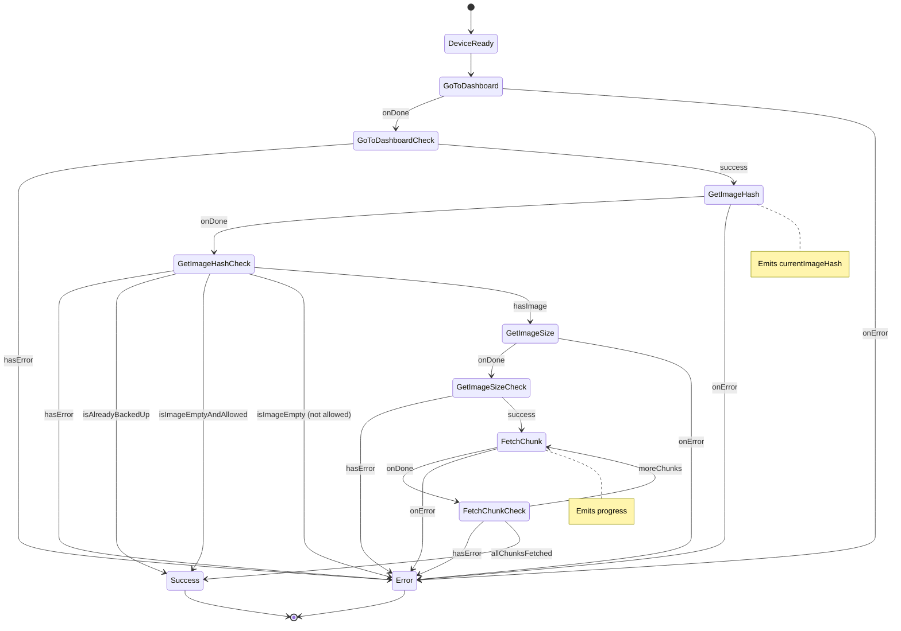

# DownloadCustomLockScreenDeviceAction

Retrieves the current custom lock screen image from the device.

## Input

| Property        | Type      | Required | Description                                 |
| --------------- | --------- | -------- | ------------------------------------------- |
| `backupHash`    | `string`  | ❌       | Hash to compare; if matches, skips download |
| `allowedEmpty`  | `boolean` | ❌       | If true, succeeds when no image exists      |
| `unlockTimeout` | `number`  | ❌       | Timeout for unlock prompt (ms)              |

## Output

Either:

| Property    | Type         | Description            |
| ----------- | ------------ | ---------------------- |
| `imageData` | `Uint8Array` | The fetched image data |
| `imageHash` | `string`     | Hash of the image      |

Or:

| Property          | Type   | Description                          |
| ----------------- | ------ | ------------------------------------ |
| `alreadyBackedUp` | `true` | Indicates image matches `backupHash` |

## User Interactions

| Interaction    | When             |
| -------------- | ---------------- |
| `UnlockDevice` | Device is locked |

## Intermediate Values

| Property                  | Type                      | Description                  |
| ------------------------- | ------------------------- | ---------------------------- |
| `requiredUserInteraction` | `UserInteractionRequired` | Current required interaction |
| `progress`                | `number`                  | Download progress (0 to 1)   |
| `currentImageHash`        | `string`                  | Hash of image on device      |

## State Machine Diagram



## Usage Example

```typescript
import {
  DeviceActionStatus,
  DownloadCustomLockScreenDeviceAction,
} from "@ledgerhq/device-management-kit";

// Basic fetch
const deviceAction = new DownloadCustomLockScreenDeviceAction({
  input: {},
});

// With backup optimization (skip if already have this hash)
const deviceActionWithBackup = new DownloadCustomLockScreenDeviceAction({
  input: {
    backupHash: "abc123def456...",
  },
});

const { observable, cancel } = dmk.executeDeviceAction({
  sessionId: "mySessionId",
  deviceAction,
});

observable.subscribe({
  next: (state) => {
    switch (state.status) {
      case DeviceActionStatus.Pending:
        console.log("Progress:", state.intermediateValue.progress);
        console.log(
          "Current image hash:",
          state.intermediateValue.currentImageHash,
        );
        break;
      case DeviceActionStatus.Completed:
        if ("alreadyBackedUp" in state.output) {
          console.log("Image already backed up, no download needed");
        } else {
          console.log("Image fetched!");
          console.log("Hash:", state.output.imageHash);
          console.log("Data:", state.output.imageData);
        }
        break;
      case DeviceActionStatus.Error:
        console.error("Failed to fetch image:", state.error);
        break;
    }
  },
});

// To cancel the device action:
// cancel();
```

## Related Documentation

For image data format, image processing utilities, and error handling, see the [Custom Lock Screen Device Actions documentation](../../../doc/CustomLockScreenDeviceActions.md).
