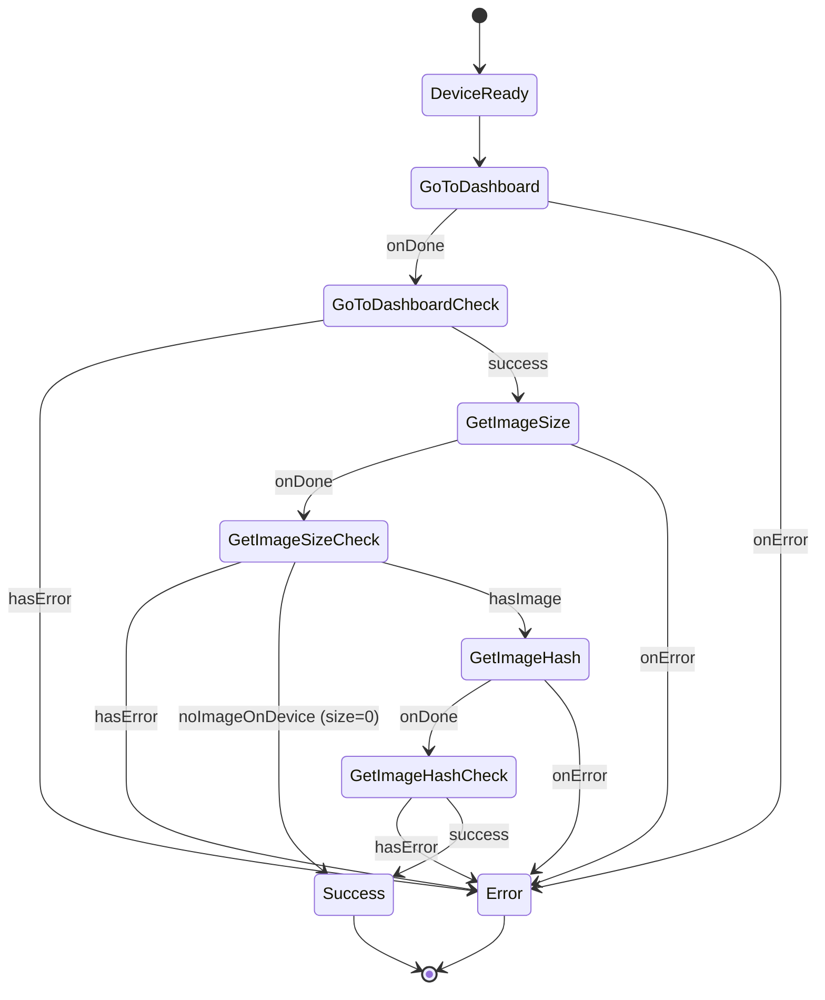

# GetCustomLockScreenInfoDeviceAction

Gets information about the custom lock screen on the device, including whether one exists, its size in bytes, and its hash.

## Input

| Property        | Type     | Required | Description                    |
| --------------- | -------- | -------- | ------------------------------ |
| `unlockTimeout` | `number` | No       | Timeout for unlock prompt (ms) |

## Output

Returns a discriminated union based on `hasCustomLockScreen`:

| Discriminant                 | Properties                                                       | Description            |
| ---------------------------- | ---------------------------------------------------------------- | ---------------------- |
| `hasCustomLockScreen: false` | `{ hasCustomLockScreen: false }`                                 | No image on device     |
| `hasCustomLockScreen: true`  | `{ hasCustomLockScreen: true, sizeBytes: number, hash: string }` | Image exists on device |

## User Interactions

| Interaction    | When             |
| -------------- | ---------------- |
| `UnlockDevice` | Device is locked |

## State Machine Diagram



## Usage Example

```typescript
import { GetCustomLockScreenInfoDeviceAction } from "@ledgerhq/ledger-wallet";

const deviceAction = new GetCustomLockScreenInfoDeviceAction({
  input: {},
});

const result = await dmk.executeDeviceAction({
  sessionId: "mySessionId",
  deviceAction,
});

result.caseOf({
  Right: (output) => {
    if (!output.hasCustomLockScreen) {
      console.log("No custom lock screen on device");
    } else {
      console.log(`Custom lock screen found:`);
      console.log(`  Size: ${output.sizeBytes} bytes`);
      console.log(`  Hash: ${output.hash}`);
    }
  },
  Left: (error) => {
    console.error("Failed to get lock screen info:", error);
  },
});
```

## Error Handling

| Error                         | Code   | Description                |
| ----------------------------- | ------ | -------------------------- |
| `DeviceInRecoveryModeDAError` | `662f` | Device is in recovery mode |
| `GoToDashboardDAError`        | -      | Failed to reach dashboard  |

Note: When there is no image on the device, GetSize returns `size=0` (per spec), which results in a successful `{ hasCustomLockScreen: false }` output. Error code `662e` is also handled as a fallback.

## Related Documentation

For image data format, image processing utilities, and error handling, see the [Custom Lock Screen Device Actions documentation](../../../../doc/CustomLockScreen.md).
