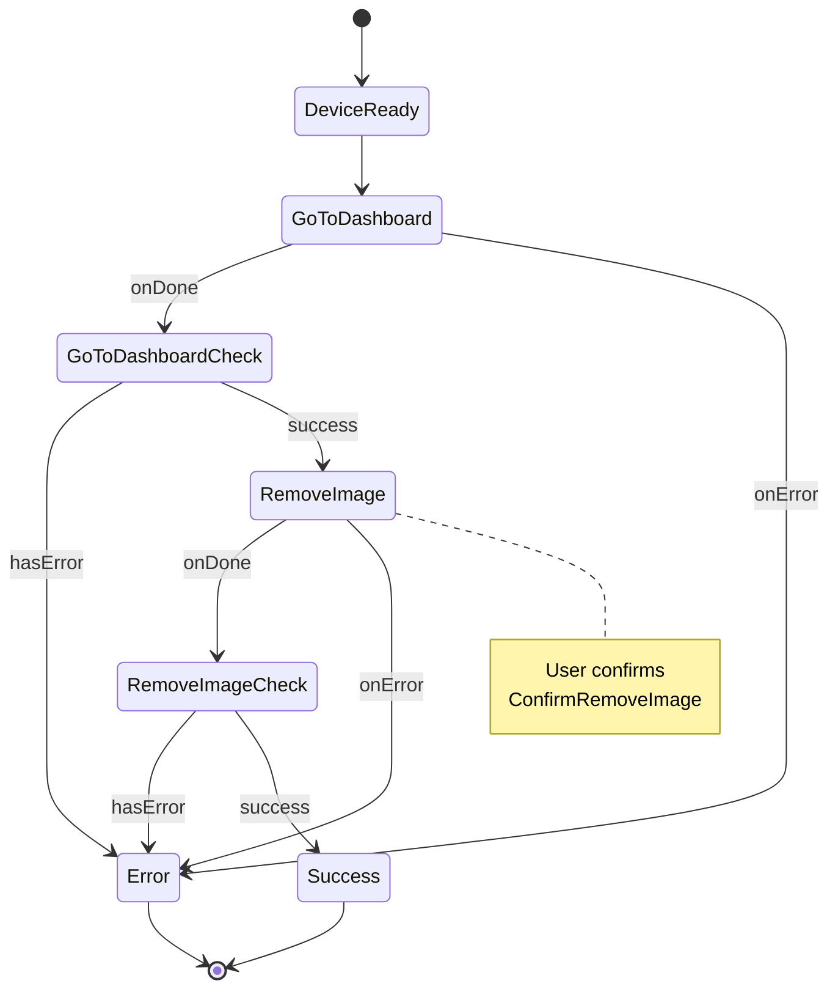

# RemoveCustomLockScreenDeviceAction

Removes the custom lock screen image from the device.

## Input

| Property        | Type     | Required | Description                    |
| --------------- | -------- | -------- | ------------------------------ |
| `unlockTimeout` | `number` | ❌       | Timeout for unlock prompt (ms) |

## Output

`void` - No output on success.

## User Interactions

| Interaction          | When                     |
| -------------------- | ------------------------ |
| `UnlockDevice`       | Device is locked         |
| `ConfirmRemoveImage` | Confirming image removal |

## State Machine Diagram



## Usage Example

```typescript
import { RemoveCustomLockScreenDeviceAction } from "@ledgerhq/ledger-wallet";

const deviceAction = new RemoveCustomLockScreenDeviceAction({
  input: {},
});

const result = await dmk.executeDeviceAction({
  sessionId: "mySessionId",
  deviceAction,
});

result.caseOf({
  Right: () => {
    console.log("Image removed successfully!");
  },
  Left: (error) => {
    console.error("Failed to remove image:", error);
  },
});
```

## Related Documentation

For image data format, image processing utilities, and error handling, see the [Custom Lock Screen Device Actions documentation](../../../../doc/CustomLockScreen.md).
