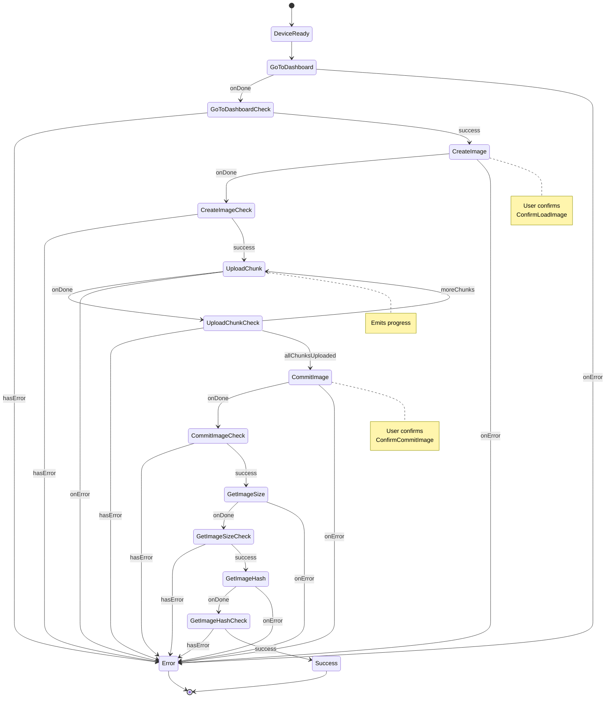

# UploadCustomLockScreenDeviceAction

Uploads a custom lock screen image to the device.

## Input

| Property        | Type         | Required | Description                    |
| --------------- | ------------ | -------- | ------------------------------ |
| `imageData`     | `Uint8Array` | ✅       | The raw image data to upload   |
| `unlockTimeout` | `number`     | ❌       | Timeout for unlock prompt (ms) |

## Output

| Property    | Type     | Description                         |
| ----------- | -------- | ----------------------------------- |
| `imageHash` | `string` | Hash of the uploaded image          |
| `imageSize` | `number` | Size of the uploaded image in bytes |

## User Interactions

| Interaction          | When                    |
| -------------------- | ----------------------- |
| `UnlockDevice`       | Device is locked        |
| `ConfirmLoadImage`   | Creating image slot     |
| `ConfirmCommitImage` | Finalizing image upload |

## Intermediate Values

| Property                  | Type                      | Description                  |
| ------------------------- | ------------------------- | ---------------------------- |
| `requiredUserInteraction` | `UserInteractionRequired` | Current required interaction |
| `progress`                | `number`                  | Upload progress (0 to 1)     |

## State Machine Diagram



## Usage Example

```typescript
import { DeviceActionStatus } from "@ledgerhq/device-management-kit";
import { UploadCustomLockScreenDeviceAction } from "@ledgerhq/ledger-wallet";

const deviceAction = new UploadCustomLockScreenDeviceAction({
  input: {
    imageData: myImageData, // Uint8Array
  },
});

const { observable, cancel } = dmk.executeDeviceAction({
  sessionId: "mySessionId",
  deviceAction,
});

observable.subscribe({
  next: (state) => {
    switch (state.status) {
      case DeviceActionStatus.Pending:
        console.log("Progress:", state.intermediateValue.progress);
        console.log(
          "User interaction required:",
          state.intermediateValue.requiredUserInteraction,
        );
        break;
      case DeviceActionStatus.Completed:
        console.log("Image uploaded successfully!");
        console.log("Hash:", state.output.imageHash);
        console.log("Size:", state.output.imageSize);
        break;
      case DeviceActionStatus.Error:
        console.error("Failed to upload image:", state.error);
        break;
    }
  },
});

// To cancel the device action:
// cancel();
```

## Related Documentation

For image data format, image processing utilities, and error handling, see the [Custom Lock Screen Device Actions documentation](../../../../doc/CustomLockScreen.md).
