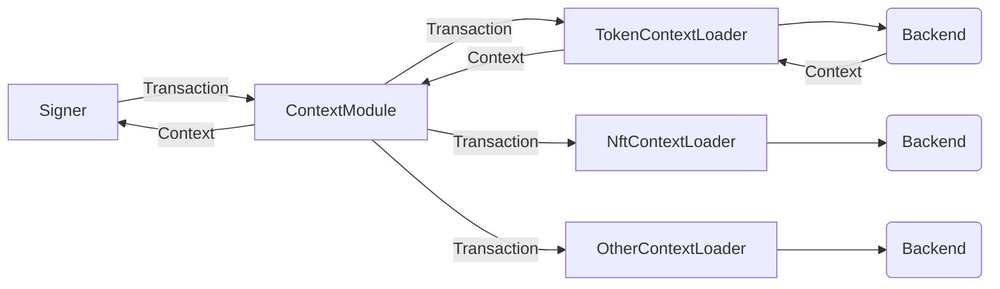

# Ledger Context Module Implementation

> [!CAUTION]
> This is still under development and we are free to make new interfaces which may lead to Device SDK breaking changes.

## Introduction

The purpose of the **Context Module** is to provide all the necessary context for the clear signing operation.
This module includes the Ledger implementation of the context module and all the default context loaders used to fetch the context of a transaction.
This open-source module can serve as an example for implementing custom context modules or loaders.

## How does it work

The Context Module features an interface utilized by the Signer module to retrieve the context of a transaction. This module comprises multiple loaders, each capable of being specified individually. Each loader attempts to fetch context from the backend relevant to its domain. For example, one loader retrieves information about tokens, another fetches information about NFTs, and so on.

The following diagram illustrates the communication between the various modules when the context for a token transaction is successfully retrieved:



## Installation

To install the context-module package, run the following command:

```sh
npm install @ledgerhq/context-module
```

## Usage

### Main Features

It currently supports the following features:

- Tokens: provide information about tokens used in the transaction.
- NFTs: provide information about NFTs used in the transaction.
- Domain name: provide information about domain names.
- Custom plugins: provide complex informations to external plugins such as the **1inch** or **paraswap** plugin.

> [!NOTE]  
> At the moment the context module is available only for Ethereum blockchain.

### Setting up

The context-module package exposes a builder `ContextModuleBuilder` which will be used to initialise the context module with your configuration.

```ts
const contextModule = new ContextModuleBuilder().build();
```

It is also possible to instantiate the context module without the default loaders.

```ts
const contextModule = new ContextModuleBuilder()
  .withoutDefaultLoaders()
  .build();
```

> [!NOTE]
> Without loaders, a transaction cannot be clear signed. Use it with caution.

You can add a custom list of loader to the context module.

```ts
// Default Token Loader
const tokenLoader = new TokenContextLoader(new TokenDataSource());

// Custom Loader
const myCustomLoader = new MyCustomLoader();

// Custom datasource for a default Token Loader
const myCustomTokenDataSource = new MyCustomTokenDataSource();
const myTokenLoader = new TokenCOntextLoader();

const contextModule = new ContextModuleBuilder()
  .withoutDefaultLoaders()
  .addLoader(tokenLoader)
  .addLoader(myTokenLoader)
  .addLoader(myCustomLoader)
  .build();
```

### Create a custom loader

A custom loader must implement the ContextLoader interface, defined as follows:

```ts
type ContextLoader = {
  load: (transaction: TransactionContext) => Promise<ClearSignContext[]>;
};
```

with ClearSignContextSuccess defined as follows:

```ts
type ClearSignContextSuccess = {
  type: "token" | "nft" | "domainName" | "plugin" | "externalPlugin";
  payload: string;
};
```

The payload should represent the data sent to the device to provide information and must be signed by a trusted authority.

### Errors handling

> [!CAUTION]
> To be defined
