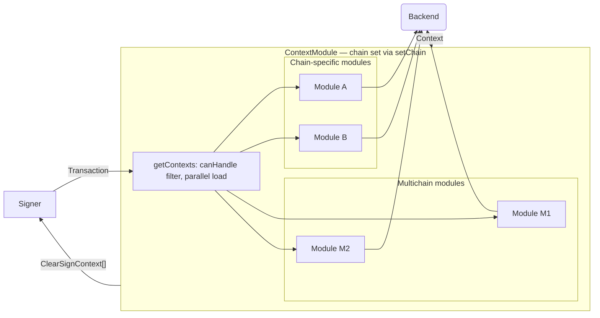

# Ledger Context Module Implementation

> [!CAUTION]
> This is still under development and we are free to make new interfaces which may lead to Device Management Kit breaking changes.

## Introduction

The purpose of the **Context Module** is to provide all the necessary context for the clear signing operation.
This module includes the Ledger implementation of the context module and all the default context loaders used to fetch the context of a transaction.
This open-source module can serve as an example for implementing custom context modules or loaders.

## How does it work

The Context Module exposes an interface to the Signer for retrieving transaction context. A Context Module instance is bound to a specific chain via `setChain` at build time, which selects the loaders that get instantiated.

When the Signer calls `getContexts(input)`, the Context Module filters loaders by `canHandle(input)` and runs the matching ones in parallel. Each loader delegates HTTP calls to its module's `DataSource`; results are aggregated and returned as a `ClearSignContext[]`.

Loaders are organized into independent modules, each containing one or more loaders and its own `DataSource`. Modules fall into two categories:

- **Chain-specific modules** — only loaded for the selected chain.
- **Multichain modules** — each contains chain-specific loader implementations that share the module's interface and `DataSource`.


```mermaid
flowchart LR
    Signer --Transaction--> Dispatch

    subgraph CM["ContextModule — chain set via setChain"]
        direction TB
        Dispatch["getContexts: canHandle filter, parallel load"]

        subgraph CHAIN["Chain-specific modules"]
            MA["Module A"]
            MB["Module B"]
        end

        subgraph MULTI["Multichain modules"]
            MM1["Module M1"]
            MM2["Module M2"]
        end

        Dispatch --> MA
        Dispatch --> MB
        Dispatch --> MM1
        Dispatch --> MM2
    end

    MA --> Backend(Backend)
    MB --> Backend
    MM1 --> Backend
    MM2 --> Backend
    Backend --Context--> CM
    CM --"ClearSignContext[]"--> Signer
```

## Installation

To install the context-module package, run the following command:

```sh
npm install @ledgerhq/context-module
```

## Usage

### Main Features

It currently supports the following features:

- Tokens: provide information about tokens used in the transaction.
- NFTs: provide information about NFTs used in the transaction.
- Domain name: provide information about domain names.
- Custom plugins: provide complex informations to external plugins such as the **1inch** or **paraswap** plugin.

> [!NOTE]  
> The context module supports Ethereum, Solana, and Concordium blockchains.

### Setting up

The context-module package exposes a builder `ContextModuleBuilder` which will be used to initialise the context module with your configuration. You must call `setChain()` before `build()`.

```ts
import {
  ContextModuleBuilder,
  ContextModuleChainID,
} from "@ledgerhq/context-module";

const contextModule = new ContextModuleBuilder({
  originToken: "origin-token", // replace with your origin token
})
  .setChain(ContextModuleChainID.Ethereum)
  .build();
```

You can use a custom configuration for your context module.

```ts
import {
  ContextModuleBuilder,
  ContextModuleChainID,
} from "@ledgerhq/context-module";

const config: ContextModuleCalConfig = {
  // config to use
};
const contextModule = new ContextModuleBuilder({
  originToken: "origin-token", // replace with your origin token
})
  .setChain(ContextModuleChainID.Ethereum)
  .addCalConfig(config)
  .build();
```

You can set a source identifier that will be included in blind signing reports. This helps distinguish which integration triggered a blind signing event. The default value is `"third-party"`.

```ts
import {
  ContextModuleBuilder,
  ContextModuleChainID,
} from "@ledgerhq/context-module";

const contextModule = new ContextModuleBuilder({
  originToken: "origin-token", // replace with your origin token
})
  .setChain(ContextModuleChainID.Ethereum)
  .setAppSource("my-app-name")
  .build();
```

It is also possible to instantiate the context module without the default loaders.

```ts
import {
  ContextModuleBuilder,
  ContextModuleChainID,
} from "@ledgerhq/context-module";

const contextModule = new ContextModuleBuilder({
  originToken: "origin-token", // replace with your origin token
})
  .setChain(ContextModuleChainID.Ethereum)
  .removeDefaultLoaders()
  .build();
```

> [!NOTE]
> Without loaders, a transaction cannot be clear signed. Use it with caution.

You can add a custom list of loader to the context module.

```ts
import {
  ContextModuleBuilder,
  ContextModuleChainID,
} from "@ledgerhq/context-module";

// Default Token Loader
const tokenLoader = new TokenContextLoader(new TokenDataSource());

// Custom Loader
const myCustomLoader = new MyCustomLoader();

// Custom datasource for a default Token Loader
const myCustomTokenDataSource = new MyCustomTokenDataSource();
const myTokenLoader = new TokenContextLoader();

const contextModule = new ContextModuleBuilder({
  originToken: "origin-token", // replace with your origin token
})
  .setChain(ContextModuleChainID.Ethereum)
  .removeDefaultLoaders()
  .addLoader(tokenLoader)
  .addLoader(myTokenLoader)
  .addLoader(myCustomLoader)
  .build();
```

### Create a custom loader

A custom loader must implement the `ContextLoader` interface:

```ts
type ContextLoader<TInput = unknown> = {
  canHandle: (
    input: unknown,
    expectedTypes: ClearSignContextType[],
  ) => input is TInput;
  load: (input: TInput) => Promise<ClearSignContext[]>;
};
```

- `canHandle` declares whether the loader applies to the given input and expected context types. Loaders that return `false` are skipped.
- `load` fetches the relevant context and returns zero or more `ClearSignContext`. Errors should be returned as an `{ type: ClearSignContextType.ERROR, error }` entry rather than thrown, so they propagate alongside other contexts.

Each returned context is one of:

```ts
type ClearSignContext = ClearSignContextSuccess | ClearSignContextError;

type ClearSignContextError = {
  type: ClearSignContextType.ERROR;
  error: Error;
};

type ClearSignContextSuccess = {
  type: ClearSignContextType; // any non-ERROR variant, e.g. ETHEREUM_TOKEN, SOLANA_LIFI, ...
  payload: string; // a few types use a typed payload — see ClearSignContext.ts
  certificate?: PkiCertificate;
};
```

Minimal example:

```ts
import {
  type ContextLoader,
  type ClearSignContext,
  ClearSignContextType,
} from "@ledgerhq/context-module";

type MyInput = { someField: string };

class MyCustomLoader implements ContextLoader<MyInput> {
  canHandle(
    input: unknown,
    expectedTypes: ClearSignContextType[],
  ): input is MyInput {
    if (!expectedTypes.includes(ClearSignContextType.ETHEREUM_TOKEN))
      return false;
    return (
      typeof input === "object" &&
      input !== null &&
      "someField" in input &&
      typeof input.someField === "string"
    );
  }

  async load(input: MyInput): Promise<ClearSignContext[]> {
    try {
      const payload = await fetchPayload(input.someField);
      return [{ type: ClearSignContextType.ETHEREUM_TOKEN, payload }];
    } catch (error) {
      return [{ type: ClearSignContextType.ERROR, error: error as Error }];
    }
  }
}
```

The `payload` represents data sent to the device and must be signed by a trusted authority.
